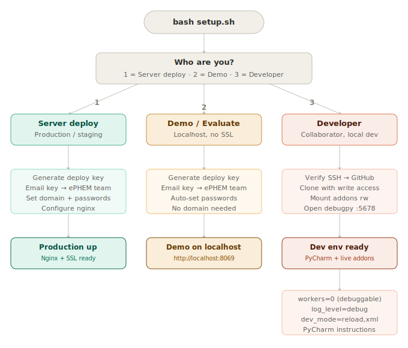

# ePHEM — Deployment Guide


Deploy and develop ePHEM using Docker. The setup script handles everything — just run it and choose your use case.

---

## Table of Contents

- [Choose Your Setup](#choose-your-setup)
- [Requirements](#requirements)
- [Quick Start](#quick-start)
  - [Step 1 — Install Docker](#step-1--install-docker)
  - [Step 2 — Clone This Repo](#step-2--clone-this-repo)
  - [Step 3 — Run Setup](#step-3--run-setup)
- [Mode 1 — Server Deploy](#mode-1--server-deploy)
  - [Configure Your Settings](#configure-your-settings)
  - [Set Up SSL](#set-up-ssl)
  - [Open ePHEM](#open-ephem)
- [Mode 2 — Demo / Evaluate](#mode-2--demo--evaluate)
- [Mode 3 — Developer](#mode-3--developer)
  - [Prerequisites](#developer-prerequisites)
  - [GitHub SSH Key](#github-ssh-key)
  - [What the Script Sets Up](#what-the-script-sets-up)
  - [PyCharm Remote Debugger](#pycharm-remote-debugger)
  - [Development Cycle](#development-cycle)
  - [Useful Developer Commands](#useful-developer-commands)
  - [Git Workflow](#git-workflow)
- [ePHEM Custom Modules](#ephem-custom-modules)
- [Adding Domains](#adding-domains)
- [Duplicating Databases](#duplicating-databases)
- [Updating ePHEM](#updating-ephem)
- [Backups](#backups)
- [Day-to-Day Commands](#day-to-day-commands)
- [Troubleshooting](#troubleshooting)
- [Uninstalling ePHEM](#uninstalling-ephem)
- [File Structure](#file-structure)
- [Security Notes](#security-notes)
- [Need Help?](#need-help)

---

## Choose Your Setup

When you run `bash setup.sh`, the first thing it asks is who you are:

```
What are you setting up?

  1) Server deploy     — Production or staging server
  2) Demo / Evaluate   — Try ePHEM locally (no development)
  3) Developer         — I'm a collaborator; I want to edit addons and use PyCharm
```

Here's how each mode works:



**Modes 1 and 2** use a read-only **deploy key** — a machine-specific key you email to the ePHEM team to get access to the private addons repo. No GitHub account needed.

**Mode 3** uses your **personal SSH key** already on GitHub — you clone with full write access, push branches, and edit addons live in PyCharm.

---

## Requirements

- **A server or computer** running one of:
  - **Linux** (Ubuntu 22.04+ recommended) — works out of the box
  - **Mac** (macOS 12+) — install [Docker Desktop for Mac](https://docs.docker.com/desktop/install/mac-install/)
  - **Windows 10/11** — install [Docker Desktop for Windows](https://docs.docker.com/desktop/install/windows-install/) and run all commands inside **WSL**
- At least **2 GB RAM**
- **SSH access** (for remote servers) or a terminal (for local machines)
- **A domain name** (for production servers) — pointed at the server's IP via a DNS A record

> **No domain?** Fine for testing and local use. The script detects this and runs on `http://YOUR_IP` or `http://localhost`. You can add a domain later.

> **Windows users:** Open a WSL terminal (search "WSL" or "Ubuntu" in Start) and run all commands there.

---

## Quick Start

### Step 1 — Install Docker

**Linux (Ubuntu/Debian):**

```bash
curl -fsSL https://get.docker.com | sh
```

```bash
sudo usermod -aG docker $USER
```

**Log out and log back in** — this is required for the group change to take effect. A new terminal alone is not enough.

Verify it worked:

```bash
groups        # should include: docker
docker --version
```

> If you skip the `usermod` step, `setup.sh` will detect it and tell you exactly what to do.

**Mac or Windows:** Install [Docker Desktop](https://docs.docker.com/desktop/) and make sure it's running. On Windows, open a **WSL terminal** for all remaining steps.

### Step 2 — Clone This Repo

```bash
git clone https://github.com/borse/ephem_deployment_docker.git ephem-deploy
cd ephem-deploy
```

> **If you see "git: command not found":** `sudo apt install -y git`

### Step 3 — Run Setup

```bash
bash setup.sh
```

The script will ask which mode you want, then handle everything from there.

> **First run:** Takes 2–5 minutes to download (~1 GB). Future runs are instant.

---

## Mode 1 — Server Deploy

For deploying ePHEM on a production or staging server.

### Configure Your Settings

Before running setup, edit your settings:

```bash
cp .env.example .env
nano .env
```

**Required — set your passwords:**

```env
POSTGRES_PASSWORD=your_strong_password_here
ODOO_ADMIN_PASSWORD=your_master_password_here
```

**Optional — set your domain:**

```env
# Production server with a domain:
DOMAIN=ephem.health.gov.xx
SSL_EMAIL=admin@health.gov.xx

# Testing without a domain (IP-only):
DOMAIN=
```

> **Generate strong passwords:** `openssl rand -base64 24`

> **New to `nano`?** Arrow keys to move, type to edit. `Ctrl+O` then `Enter` to save, `Ctrl+X` to exit.

### Set Up SSL

After setup completes, if you have a domain:

```bash
bash scripts/ssl-setup.sh ephem.health.gov.xx admin@health.gov.xx
```

### Open ePHEM

Open your browser:

- **With domain:** `https://ephem.health.gov.xx`
- **Without domain:** `http://YOUR_SERVER_IP` (shown by the setup script)

Fill in the database creation form:

| Field | What to enter |
|-------|--------------|
| **Master Password** | Your `ODOO_ADMIN_PASSWORD` |
| **Database Name** | Your subdomain (e.g. `ephem`) or any name |
| **Email** | Your admin email |
| **Password** | Admin user password |
| **Language** | Your language |
| **Country** | Your country |

Click **Create Database** (takes 1–2 minutes). 🎉

---

## Mode 2 — Demo / Evaluate

For trying ePHEM locally without any development intent.

Run `bash setup.sh` and choose **2**. The script:

- Auto-generates passwords (no `.env` editing needed)
- Skips domain and SSL configuration
- Starts ePHEM at `http://localhost:8069`

When you're done:

```bash
docker compose down        # stop (keep data)
docker compose down -v     # stop and delete all data
```

---

## Mode 3 — Developer

For collaborators who want to edit ePHEM custom addons locally, with live reloading and PyCharm debugging.

### Developer Prerequisites

- **Docker Desktop** — [Mac](https://docs.docker.com/desktop/install/mac-install/) · [Windows](https://docs.docker.com/desktop/install/windows-install/) · [Linux](https://docs.docker.com/desktop/install/linux-install/)
- **PyCharm** — [Community](https://www.jetbrains.com/pycharm/download/) (free) or Professional
- **Git** — pre-installed on Mac/Linux. Windows: [git-scm.com](https://git-scm.com/download/win) or WSL
- **Collaborator access** on `borse/ePHEM` — request this from the ePHEM team

### GitHub SSH Key

Developer mode uses your personal SSH key — the same one you use to push to GitHub. You do **not** get a deploy key; you use your own identity.

**Check if you already have a key:**

```bash
cat ~/.ssh/id_ed25519.pub
```

**If not, generate one:**

```bash
ssh-keygen -t ed25519 -C "your@email.com"
```

**Add it to GitHub:**

1. Copy the output of `cat ~/.ssh/id_ed25519.pub`
2. Go to [github.com/settings/keys](https://github.com/settings/keys)
3. Click **New SSH key**, paste, save

**Verify it works:**

```bash
ssh -T git@github.com
# Hi yourname! You've successfully authenticated...
```

The setup script runs this check automatically and stops with clear instructions if it fails.

### What the Script Sets Up

When you choose mode 3, `setup.sh`:

1. Verifies your GitHub SSH access
2. Asks which branch to work on (`18_national_dev` recommended)
3. Clones the addons repo with **full write access** (not depth-limited)
4. Creates `docker-compose.override.yml` with:
   - `custom-addons/` mounted **read-write** (live editing — no container rebuild needed)
   - Nginx and Certbot disabled — Odoo is accessed directly on `:8069`
5. Writes a developer `odoo.conf` with:
   - `workers = 0` — threading mode, simpler for local use
   - `log_level = debug` — verbose output in the logs
   - `dev_mode = reload,qweb,werkzeug,xml` — enables live asset reloading in the browser

> `docker-compose.override.yml` is picked up automatically by Docker Compose and should **not** be committed. Add it to `.gitignore`.

### Open in PyCharm

1. Open PyCharm
2. **File → Open** → select the `custom-addons/` folder
3. PyCharm opens with all ePHEM modules in the project tree

Your project structure will look like:

```
custom-addons/
├── eoc_base/
├── eoc_signals/
├── eoc_actors/
├── eoc_incident_management/
├── eoc_dashboard/
├── ...
```

PyCharm Community understands Odoo's Python and XML — you get full autocomplete, go-to-definition, and error highlighting without any extra configuration.

### Development Cycle

**Edit → Restart → Test:**

1. Edit any file in `custom-addons/` in PyCharm
2. Restart Odoo to pick up changes:

```bash
docker compose restart odoo
```

3. Test at `http://localhost:8069`

**Update a specific module** (re-reads views, data files, and code):

```bash
docker compose exec odoo odoo -u your_module_name -d YOUR_DB --db_host db --db_user odoo --db_password dev --stop-after-init --no-http
```

Or use the interactive script:

```bash
bash scripts/update-modules.sh
```

**Watch logs in real time:**

```bash
docker compose logs -f odoo
```

**Filter for errors only:**

```bash
docker compose logs -f odoo 2>&1 | grep -E "ERROR|Traceback|WARNING"
```

> **Tip:** For Python changes, restart Odoo. For XML/CSS, a browser reload is often enough (with `dev_mode` on).

### Useful Developer Commands

| What you want to do | Command |
|---------------------|---------|
| Start everything | `docker compose up -d` |
| Stop everything | `docker compose down` |
| Restart Odoo (after code changes) | `docker compose restart odoo` |
| View Odoo logs | `docker compose logs -f odoo` |
| Open Odoo Python shell | `docker compose exec odoo odoo shell -d YOUR_DB --db_host db --db_user odoo --db_password dev --no-http` |
| Open PostgreSQL console | `docker compose exec db psql -U odoo` |
| List databases | `docker compose exec db psql -U odoo -d postgres -c "\l"` |
| Check container status | `docker compose ps` |
| Pull latest Docker image | `docker compose pull && docker compose up -d` |

### Git Workflow

**From PyCharm:**

- **Git → Commit** (`Ctrl+K`) to commit
- **Git → Push** (`Ctrl+Shift+K`) to push
- **Git → Pull** to get latest
- Branch switching: bottom-right corner of PyCharm

**From the terminal:**

```bash
cd custom-addons
git status
git add .
git commit -m "your message"
git push
```

---

## ePHEM Custom Modules

The ePHEM custom modules live in a private repository.

**For server deploy and demo (modes 1 & 2):** The setup script generates a machine-specific deploy key and shows it at the end. Email it to **`ephem@who.int`** with your country/server name in the subject. Once the team grants access, run `bash setup.sh` again — it clones the modules automatically.

**For developers (mode 3):** You need collaborator access on `borse/ePHEM`. Request this from the ePHEM team. Once granted, the setup script clones using your personal SSH key.

> **While waiting for access**, ePHEM runs with standard Odoo modules. You can create databases, configure users, and explore the interface. ePHEM-specific modules appear in **Apps** after access is granted and setup is re-run.

---

## Adding Domains

Run multiple databases on the same server — for example production, training, and simulation. Each domain points to its own independent database.

| URL | Database |
|-----|----------|
| `ephem.health.gov.xx` | `ephem` |
| `training.health.gov.xx` | `training` |
| `simex.health.gov.xx` | `simex` |

Before adding a domain, create a DNS A record pointing it to this server's IP.

**Add a single domain:**

```bash
bash scripts/add-domain.sh training.health.gov.xx
```

**Add multiple domains at once:**

```bash
bash scripts/add-domain.sh training.health.gov.xx simex.health.gov.xx
```

**Create a database for the new domain** at:

```
https://training.health.gov.xx/web/database/manager
```

> The database name must match the subdomain. For `training.health.gov.xx`, name it `training`.

**Disable the database manager** once all databases are set up:

```bash
nano .env   # set ODOO_LIST_DB=False
bash setup.sh
```

---

## Duplicating Databases

Create identical copies of a configured database — useful for training rooms where each group gets their own environment.

**Example: 6 training environments:**

```bash
# 1. Add all domains
bash scripts/add-domain.sh training-01.pheoc.com training-02.pheoc.com training-03.pheoc.com training-04.pheoc.com training-05.pheoc.com training-06.pheoc.com

# 2. Configure training-01 at https://training-01.pheoc.com

# 3. Duplicate to all others
bash scripts/duplicate-db.sh training-01 training-02 training-03 training-04 training-05 training-06
```

All 6 databases are identical and completely independent.

---

## Updating ePHEM

### Update Custom Modules

```bash
cd custom-addons && git pull && cd ..
docker compose restart odoo
```

Then go to **Apps → Update Apps List**.

### Update Deployment Configuration

```bash
git pull
bash setup.sh
```

> `git pull` never overwrites `.env`, `nginx/active.conf`, or `odoo.conf`.

### Update Odoo Base Image

```bash
bash scripts/backup.sh
docker compose pull
docker compose up -d
```

### Update Modules Across All Databases

```bash
bash scripts/update-modules.sh --auto
```

Or for a specific database:

```bash
bash scripts/update-modules.sh --auto --db training-server
```

---

## Backups

```bash
bash scripts/backup.sh
```

**Automatic daily backups:**

```bash
crontab -e
```

Add:

```
0 2 * * * /home/YOUR_USERNAME/ephem-deploy/scripts/backup.sh >> /home/YOUR_USERNAME/ephem-deploy/backups/backup.log 2>&1
```

Backups older than 14 days are deleted automatically.

> **Important:** Copy backups off the server regularly. Local backups are lost if the server fails.

**Restore from backup:**

```bash
docker compose stop odoo
gunzip < backups/DBNAME_TIMESTAMP.sql.gz | docker compose exec -T db psql -U odoo -d DBNAME
docker compose start odoo
```

---

## Day-to-Day Commands

Run from inside the `ephem-deploy` folder.

| What you want to do | Command |
|---------------------|---------|
| Start the system | `docker compose up -d` |
| Stop the system | `docker compose down` |
| Restart Odoo | `docker compose restart odoo` |
| Restart everything | `docker compose restart` |
| Check status | `docker compose ps` |
| View Odoo logs | `docker compose logs -f odoo` |
| Run a backup | `bash scripts/backup.sh` |
| Add a domain | `bash scripts/add-domain.sh new.domain.com` |
| Duplicate a database | `bash scripts/duplicate-db.sh source target1 target2` |
| Update modules | `bash scripts/update-modules.sh` |
| Re-run setup | `bash setup.sh` |

> Press `Ctrl+C` to stop watching logs.

---

## Troubleshooting

### Nothing loads in the browser

```bash
docker compose ps
docker compose up -d
```

### Odoo errors or blank pages

```bash
docker compose logs --tail=30 odoo
```

### Permission denied connecting to Docker

This means your user isn't in the `docker` group yet. Run:

```bash
sudo usermod -aG docker $USER
```

Then **log out and log back in completely** — not just a new terminal, a full desktop/SSH logout. This is required because running processes (including PyCharm) inherit group memberships from the login session and won't see the change until you re-login.

After logging back in, verify it worked:

```bash
groups
# should now include: docker
```

Then run `bash setup.sh` again.

> **Why doesn't `newgrp docker` work?** `newgrp` only applies to the current terminal session. PyCharm and other GUI apps launched from the desktop still run without the `docker` group until you do a full logout.

### New domain shows wrong database

Make sure `ODOO_DBFILTER=%d` is set in `.env` and database names match subdomains exactly, then:

```bash
bash setup.sh
```

### Custom modules not appearing

```bash
chmod -R 755 custom-addons/
docker compose restart odoo
```

Go to **Apps → Update Apps List**.

### SSL not working

```bash
sudo ufw allow 80
sudo ufw allow 443
bash scripts/ssl-setup.sh yourdomain.com your@email.com
```

### Start completely fresh

> **Warning:** Deletes ALL data.

```bash
docker compose down -v
rm -f nginx/active.conf
bash setup.sh
```

---

## Uninstalling ePHEM

```bash
cd ephem-deploy
docker compose down -v
docker rmi borrs/ephem:latest nginx:alpine postgres:16-alpine certbot/certbot
cd ..
rm -rf ephem-deploy
```

**Also remove Docker (Linux):**

```bash
sudo apt remove -y docker-ce docker-ce-cli containerd.io docker-compose-plugin
```

**Mac:** Docker Desktop → Settings → Uninstall.

**Windows:** Windows Settings → Apps → Docker Desktop → Uninstall.

---

## File Structure

```
ephem-deploy/
│
├── docker-compose.yml              ← Container definitions (production)
├── docker-compose.override.yml     ← Developer overrides (generated, not committed)
├── .env.example                    ← Settings template — copy to .env
├── .env                            ← Your settings (never committed)
├── odoo.conf                       ← Odoo config (generated by setup.sh)
├── setup.sh                        ← Main setup script
│
├── nginx/
│   ├── default.conf                ← HTTP-only template (in Git, never modified)
│   └── active.conf                 ← Active NGINX config (created by scripts)
│
├── custom-addons/                  ← ePHEM modules (private repo)
│                                     read-only in production, read-write in dev
│
├── scripts/
│   ├── ssl-setup.sh                ← Set up SSL certificates
│   ├── add-domain.sh               ← Add new domains
│   ├── duplicate-db.sh             ← Copy databases
│   ├── update-modules.sh           ← Update Odoo modules across databases
│   ├── backup.sh                   ← Backup databases and filestore
│   ├── clone-addons.sh             ← Clone addons after access is granted
│   └── request-addons-access.sh    ← Generate deploy key
│
├── backups/                        ← Backup files
└── logs/                           ← Module update logs
```

---

## Security Notes

**Built-in:**

- PostgreSQL and Odoo are hidden from the internet — only NGINX is exposed
- All traffic encrypted with HTTPS (TLS 1.2+)
- Security headers protect against common web attacks
- Rate limiting prevents abuse
- Containers run on a private Docker network
- SSL certificates renew automatically

**Recommended after installation:**

- Disable password-based SSH login (use SSH keys only)
- Install fail2ban: `sudo apt install -y fail2ban`
- Copy backups off the server regularly
- Enable two-factor authentication for admin users (Settings → Permissions)
- Disable the database manager after setup (`ODOO_LIST_DB=False` in `.env`)

---

## Need Help?

1. Check [Troubleshooting](#troubleshooting)
2. Run `docker compose logs` and share the output with the ePHEM team
3. Open an issue: [github.com/borse/ephem_deployment_docker/issues](https://github.com/borse/ephem_deployment_docker/issues)
