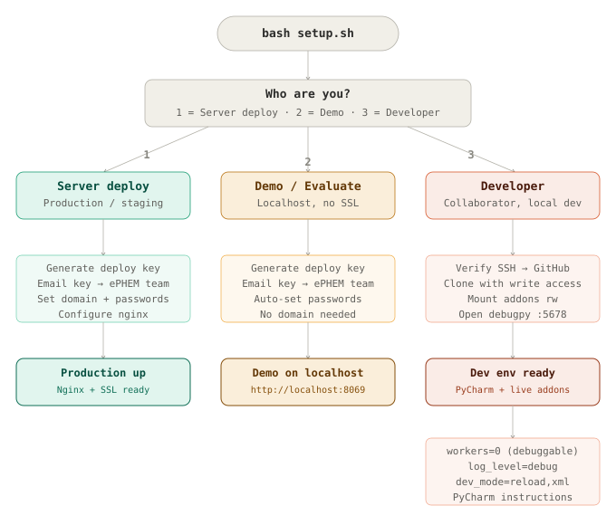

# ePHEM — Deployment Guide


Deploy and develop ePHEM using Docker. The setup script handles everything — just run it and choose your use case.

---

## Table of Contents

- [Choose Your Setup](#choose-your-setup)
- [Requirements](#requirements)
- [Windows — Run Inside WSL](#windows--run-inside-wsl)
- [Quick Start](#quick-start)
  - [Step 1 — Install Git](#step-1--install-git)
  - [Step 2 — Clone the repo](#step-2--clone-the-repo)
  - [Step 3 — Run setup](#step-3--run-setup)
- [Mode 1 — Server Deploy](#mode-1--server-deploy)
  - [Configure Your Settings](#configure-your-settings)
  - [Set Up SSL](#set-up-ssl)
  - [Open ePHEM](#open-ephem)
- [Mode 2 — Demo / Evaluate](#mode-2--demo--evaluate)
- [Mode 3 — Developer](#mode-3--developer)
  - [Developer Prerequisites](#developer-prerequisites)
  - [GitHub SSH Key](#github-ssh-key)
  - [Developer Pre-Flight Menu](#developer-pre-flight-menu)
  - [What the Script Sets Up](#what-the-script-sets-up)
  - [Open in PyCharm](#open-in-pycharm)
  - [Docker Plugin for PyCharm](#docker-plugin-for-pycharm)
  - [Colored Logs + One-Click Restart in PyCharm](#colored-logs--one-click-restart-in-pycharm)
  - [Development Cycle](#development-cycle)
  - [Switching to a New Remote Branch](#switching-to-a-new-remote-branch)
  - [Multi-Instance Dev — Several Odoo Servers Side by Side](#multi-instance-dev--several-odoo-servers-side-by-side)
  - [Useful Developer Commands](#useful-developer-commands)
  - [Git Workflow](#git-workflow)
- [ePHEM Custom Modules](#ephem-custom-modules)
- [Adding Domains](#adding-domains)
- [Duplicating Databases](#duplicating-databases)
- [Updating ePHEM](#updating-ephem)
- [Backups](#backups)
- [Day-to-Day Commands](#day-to-day-commands)
- [Troubleshooting](#troubleshooting)
- [Uninstalling ePHEM](#uninstalling-ephem)
- [File Structure](#file-structure)
- [Security Notes](#security-notes)
- [Need Help?](#need-help)

---

## Choose Your Setup

When you run `bash setup.sh`, the first thing it asks is who you are:

```
What are you setting up?

  1) Server deploy     — Production or staging server
  2) Demo / Evaluate   — Try ePHEM locally (no development)
  3) Developer         — I'm a collaborator; I want to edit addons and use PyCharm
```

Here's how each mode works:



**Modes 1 and 2** use a read-only **deploy key** — a machine-specific key you email to the ePHEM team to get access to the private addons repo. No GitHub account needed.

**Mode 3** uses your **personal SSH key** already on GitHub — you clone with full write access, push branches, and edit addons live in PyCharm.

---

## Requirements

- **A server or computer** running one of:
  - **Linux** (Ubuntu 22.04+ recommended) — works out of the box
  - **Mac** (macOS 12+) — install [Docker Desktop for Mac](https://docs.docker.com/desktop/install/mac-install/)
  - **Windows 10/11** — see [Windows — Run Inside WSL](#windows--run-inside-wsl) below
- At least **2 GB RAM**
- **SSH access** (for remote servers) or a terminal (for local machines)
- **A domain name** (for production servers with SSL) — pointed at the server's IP via a DNS A record

> **No domain?** Fine for testing and local use. The script detects this and runs on `http://YOUR_IP:8069` or `http://localhost:8069`. You can add a domain later.

---

## Windows — Run Inside WSL

`setup.sh` is a bash script. On Windows, run it inside **WSL** (Windows Subsystem for Linux). Docker Desktop integrates with WSL out of the box — this setup is well-tested on Windows 11 + Ubuntu + Docker Desktop.

Because `setup.sh` runs *inside* WSL, it can't install WSL itself — that one bootstrap happens on the Windows side first. After that, the steps are identical to Linux (install git → clone → `bash setup.sh`), just run inside the Ubuntu terminal.

**One-time WSL setup:**

1. Open **PowerShell as Administrator** and install WSL with Ubuntu:

   ```powershell
   wsl --install -d Ubuntu
   ```

   Reboot if asked, then finish the Ubuntu setup (UNIX username + password) when the Ubuntu window opens.

2. Install [Docker Desktop for Windows](https://docs.docker.com/desktop/install/windows-install/) (or, in an Administrator PowerShell: `winget install -e --id Docker.DockerDesktop`). Then open Docker Desktop → **Settings → Resources → WSL integration** and enable it for your Ubuntu distro. Make sure Docker Desktop is running.

3. Open the **Ubuntu** terminal from the Start menu (not PowerShell) and continue with the [Quick Start](#quick-start) below — install git, clone, and run `bash setup.sh`. `setup.sh` verifies Docker is reachable from WSL and tells you exactly what to fix if not.

**From here on, run every command in this README inside the Ubuntu (WSL) terminal**, not PowerShell or CMD.

> **Where to clone the repo:** keep it inside the Linux home folder (e.g. `/home/<you>/ephem-deploy`), not under `/mnt/c/...`. Files under `/mnt/c` work, but bind-mounts and Docker volumes are much slower there.

**Using PyCharm on Windows with WSL:**

- Open the project from the WSL filesystem: `File → Open` and paste `\\wsl.localhost\Ubuntu\home\<you>\ephem-deploy\custom-addons`.
- Optional but recommended: configure a **WSL-based Python interpreter** (PyCharm Professional) or just open the WSL path — Community Edition handles it fine for editing.
- For the Shell Script run config that calls `scripts/dev-logs.sh` (see [Colored Logs + One-Click Restart in PyCharm](#colored-logs--one-click-restart-in-pycharm)), point **Script path** at the WSL form, e.g.:

  ```
  \\wsl.localhost\Ubuntu\home\<you>\ephem-deploy\scripts\dev-logs.sh
  ```

  PyCharm executes it through WSL automatically because it lives on the WSL filesystem. The same applies for per-instance configs (`dev-logs.sh a`, `dev-logs.sh b`, …).

> **Editing files from Windows:** any editor (PyCharm, VS Code, Notepad++) can edit the WSL files via `\\wsl.localhost\Ubuntu\...`. Avoid copying the folder to `C:\` and editing there — keep one canonical copy under WSL.

---

## Quick Start

The whole process is three steps, the same on every platform:

**1. Install git → 2. Clone the repo → 3. Run `bash setup.sh` → follow the prompts.**

`setup.sh` does everything else — it checks and installs Docker, downloads images, clones the ePHEM addons, and starts the containers.

> **Windows:** do the [one-time WSL setup](#windows--run-inside-wsl) first, then run these three steps **inside the Ubuntu (WSL) terminal**.

### Step 1 — Install Git

- **Linux (Ubuntu/Debian):** `sudo apt update && sudo apt install -y git`
- **Mac:** `xcode-select --install` (Apple's command-line tools include git), or `brew install git`
- **Windows (WSL):** in the Ubuntu terminal — `sudo apt update && sudo apt install -y git`

> Git comes first because you need it to clone the repo that contains `setup.sh` — the script can't install git for that first clone.

### Step 2 — Clone the repo

```bash
git clone https://github.com/borse/ephem_deployment_docker.git ephem-deploy
cd ephem-deploy
```

### Step 3 — Run setup

```bash
bash setup.sh
```

The script asks which mode you want (**Server / Demo / Developer**), then handles the rest: it checks or installs Docker, creates config files, downloads images, clones addons, and starts the containers. Just follow the prompts.

> **First run:** downloads ~1 GB of Docker images (2–5 minutes). Future runs are quick.

---

## Mode 1 — Server Deploy

For deploying ePHEM on a production or staging server.

### Configure Your Settings

When you run `bash setup.sh` and choose **1**, the script creates a `.env` file from the template and immediately stops to ask you to fill it in. Open it:

```bash
nano .env
```

**Required — set real passwords:**

```env
POSTGRES_PASSWORD=your_strong_password_here
ODOO_ADMIN_PASSWORD=your_master_password_here
```

**Recommended for production — set your domain:**

```env
DOMAIN=ephem.health.gov.xx
SSL_EMAIL=admin@health.gov.xx
```

> **Generate strong passwords:** `openssl rand -base64 24`

> **New to `nano`?** Arrow keys to move, type to edit. `Ctrl+O` then `Enter` to save, `Ctrl+X` to exit.

Once saved, run setup again:

```bash
bash setup.sh
```

### Set Up SSL

After setup completes, if you set a domain, enable HTTPS:

```bash
bash scripts/ssl-setup.sh ephem.health.gov.xx admin@health.gov.xx
```

> **SSL prerequisite:** Port 80 and 443 must be open on your server firewall, and your domain DNS must already point to the server's IP. Let's Encrypt will fail if either is missing.

### Open ePHEM

Open your browser:

- **With SSL:** `https://ephem.health.gov.xx`
- **With domain, no SSL yet:** `http://ephem.health.gov.xx`
- **Without domain:** `http://YOUR_SERVER_IP` (shown by the setup script)

Fill in the database creation form:

| Field | What to enter |
|-------|--------------|
| **Master Password** | Your `ODOO_ADMIN_PASSWORD` |
| **Database Name** | Your subdomain (e.g. `ephem`) or any name |
| **Email** | Your admin email |
| **Password** | Admin user password |
| **Language** | Your language |
| **Country** | Your country |

Click **Create Database** (takes 1–2 minutes). 🎉

---

## Mode 2 — Demo / Evaluate

For trying ePHEM on any machine — locally or on a cloud server — without any development intent.

Run `bash setup.sh` and choose **2**. The script:

- Creates a `.env` with auto-generated passwords (no editing needed)
- Skips domain and SSL — Odoo is exposed directly on port 8069
- Starts ePHEM and shows you the URLs to access it

At the end you'll see:

```
Your demo is available at:
  http://localhost:8069        (on this machine)
  http://YOUR_SERVER_IP:8069  (from other devices on the network)
```

When you're done:

```bash
docker compose down        # stop (keep data)
docker compose down -v     # stop and delete all data
```

---

## Mode 3 — Developer

For collaborators who want to edit ePHEM custom addons locally, with live reloading and PyCharm integration.

### Developer Prerequisites

- **Docker** — `setup.sh` installs/checks it for you (see [Quick Start](#quick-start)); on Linux it also adds you to the `docker` group
- **Git** — install it first (see [Step 1 — Install Git](#step-1--install-git)); on Windows, use git inside WSL
- **PyCharm** — [Community Edition](https://www.jetbrains.com/pycharm/download/) (free) or Professional
- **Collaborator access** on `borse/ePHEM` — request this from the ePHEM team before running setup

### GitHub SSH Key

New to SSH keys? An SSH key is a passwordless way to prove who you are to GitHub. Developer mode uses **your personal key** — the same identity you'd use to push code. `setup.sh` checks this automatically and, if it fails, prints these exact steps, so you can also just run setup and follow along.

For it to work, **both** of these must be true:

1. An SSH key exists on this machine and is added to your GitHub account.
2. Your GitHub username has **collaborator access** to `borse/ePHEM` (ask the ePHEM team to add you).

> **On Windows:** do all of this inside the **Ubuntu (WSL)** terminal, not PowerShell. The key must live in WSL's `~/.ssh` — that's the one `setup.sh` uses.

**Step 1 — Do you already have a key?** If this prints a line, skip to Step 3:

```bash
cat ~/.ssh/id_ed25519.pub
```

**Step 2 — If not, create one** (press Enter at every prompt to accept defaults):

```bash
ssh-keygen -t ed25519 -C "your@email.com"
```

**Step 3 — Add the public key to GitHub:**

1. Copy the full output of `cat ~/.ssh/id_ed25519.pub`
2. Go to [github.com/settings/keys](https://github.com/settings/keys)
3. Click **New SSH key**, paste, and save

**Step 4 — Verify it works:**

```bash
ssh -T git@github.com
# Hi yourname! You've successfully authenticated...
```

**Troubleshooting**

- **`Permission denied (publickey)`** — the key isn't on your GitHub account (redo Step 3), or you're on Windows but generated the key outside WSL (regenerate it in the Ubuntu terminal).
- **Authenticates as the wrong user, or "Repository not found" when cloning** — that account isn't a collaborator on `borse/ePHEM` yet. Send your GitHub username to the ePHEM team.
- **Have several keys?** Make sure the right one is offered: `ssh-add ~/.ssh/id_ed25519` (start the agent first with `eval "$(ssh-agent -s)"`).

### Developer Pre-Flight Menu

After choosing mode 3, the script first asks whether you've set up this machine before:

```
Have you already set up the ePHEM dev environment on this machine before? [y/N]:
```

- **First-time (`N` or just press Enter)** — installation continues straight away. No menu, no clicks.
- **Returning (`y`)** — you get a menu of day-to-day developer actions before re-running setup:

```
  1) View relevant commands
  2) Suggest commands (based on current state)
  3) Open GitHub README / docs
  4) Prerequisite check (docker, compose, git, ssh)
  5) Container status / health
  6) Doctor — scan logs for common errors
  7) Reset / clean environment (keeps custom-addons)
  8) Multi-instance dev — run several Odoo side by side
  9) Fetch & switch to a remote branch (custom-addons or other)
 10) Continue with setup
 11) Exit
```

Things worth knowing about the menu:

- **6) Doctor** scans the last 300 lines of Odoo's log for common errors (missing Python module, registry failure, DB connectivity) and prints the exact fix command.
- **7) Reset** is the safe way to wipe DB + filestore volumes when you want a clean start. It **never** touches `custom-addons/`.
- **8) Multi-instance dev** runs several Odoo servers side by side — see [Multi-Instance Dev](#multi-instance-dev--several-odoo-servers-side-by-side).
- **9) Fetch & switch to a remote branch** is for the case where a teammate pushed a new branch upstream that your local `git branch -a` doesn't see yet — see [Switching to a New Remote Branch](#switching-to-a-new-remote-branch).
- You can re-enter this menu any time by re-running `bash setup.sh` and choosing **3 → y**.

### What the Script Sets Up

When you choose mode 3, `setup.sh`:

1. Verifies your GitHub SSH access
2. Asks which branch to work on (`18_national_dev` recommended)
3. Clones the addons repo with **full write access** (not depth-limited)
4. Creates `docker-compose.override.yml` with:
   - `custom-addons/` mounted **read-write** (live editing — no container rebuild needed)
   - Nginx and Certbot disabled — Odoo is accessed directly on `:8069`
5. Writes a developer `odoo.conf` with:
   - `workers = 0` — threading mode, simpler for local use
   - `log_level = debug` — verbose output in the logs
   - `dev_mode = reload,qweb,werkzeug,xml` — enables live asset reloading in the browser

> `docker-compose.override.yml` is picked up automatically by Docker Compose. Add it to `.gitignore` — do not commit it.

### Open in PyCharm

1. Open PyCharm
2. **File → Open** → select the `custom-addons/` folder
3. PyCharm opens with all ePHEM modules in the project tree

Your project structure will look like:

```
custom-addons/
├── eoc_base/
├── eoc_signals/
├── eoc_actors/
├── eoc_incident_management/
├── eoc_dashboard/
├── ...
```

PyCharm Community understands Odoo's Python and XML — you get full autocomplete, go-to-definition, and error highlighting without any extra configuration.

### Docker Plugin for PyCharm

The Docker plugin lets you start, stop, and restart containers and watch live logs — all from inside PyCharm without touching a terminal.

**Install:**

1. **Settings → Plugins** → search "Docker" → Install → restart PyCharm
2. **Settings → Build, Execution, Deployment → Docker** → click `+` → select **Unix socket** (auto-detected)
3. A **Services** panel appears at the bottom (**View → Tool Windows → Services**)

From the Services panel you can:

- See all running containers
- Start / stop / restart `ephem-app` with one click
- View live logs per container in a dedicated tab — persistent across PyCharm restarts

> **Permission denied in the Docker plugin?** Your user isn't in the `docker` group or the session hasn't picked it up yet. See [Permission denied connecting to Docker](#permission-denied-connecting-to-docker) in Troubleshooting.

### Development Cycle

The whole loop is one command: **`scripts/dev-logs.sh`** restarts Odoo and streams the colored logs — and can update or install modules first. Wire it to a green ▶ in PyCharm (see [Colored Logs + One-Click Restart in PyCharm](#colored-logs--one-click-restart-in-pycharm)) and each step below becomes a single click.

**Edit → Restart → Test:**

1. Edit any file in `custom-addons/` in PyCharm.
2. Restart Odoo and watch the logs:

   ```bash
   bash scripts/dev-logs.sh          # restart + tail colored logs
   ```

3. Test at `http://localhost:8069`.

**Update a specific module** (needed after XML / view / data-file changes — `-d` is your database name):

```bash
bash scripts/dev-logs.sh -u your_module -d yourdb      # update, restart, then tail
bash scripts/dev-logs.sh -u mod1,mod2 -d yourdb        # several at once
```

> **Multi-instance?** Put the instance name first — the database is filled in for you: `bash scripts/dev-logs.sh 1 -u your_module`.

**Watch logs / filter for errors:**

```bash
docker compose logs -f odoo                                          # all logs
docker compose logs -f odoo 2>&1 | grep -E "ERROR|Traceback|WARNING" # errors only
```

**Under the hood** — if you ever need the raw commands `dev-logs.sh` wraps:

```bash
docker compose restart odoo
docker compose exec odoo odoo -u your_module -d yourdb --db_host db --db_user odoo \
  --db_password "$(grep '^POSTGRES_PASSWORD=' .env | cut -d= -f2-)" --stop-after-init --no-http
# or the interactive helper:
bash scripts/update-modules.sh
```

> **Tip:** Python changes reload on restart (dev mode, `workers=0`). XML / CSS / QWeb changes need `-u <module>` (or a browser reload with `dev_mode` on).

### Switching to a New Remote Branch

A teammate just pushed a new branch (e.g. `18_national_dev_new_IAP_levels`) and your `git branch -a` doesn't see it? Developer mode clones with `--single-branch`, so the remote refspec only tracks the branch you originally chose. To pull in any other branch, use the pre-flight menu:

```bash
bash setup.sh    # → 3 (Developer) → y (already set up) → 9 (Fetch & switch)
```

You'll be prompted for:

- **Repo folder** — defaults to `custom-addons` (just press Enter). Any other path is allowed too.
- **Branch name** — e.g. `18_national_dev_new_IAP_levels`.

The script then runs, inside that folder:

```bash
git config remote.origin.fetch "+refs/heads/*:refs/remotes/origin/*"
git fetch origin <branch>
git switch <branch>
```

The first command rewrites the clone's refspec so future `git fetch` calls pick up **all** remote branches — a one-time fix for the `--single-branch` clone.

> **Manual equivalent:** run the three commands above from inside the target folder (`cd custom-addons` first). The menu option is exactly this, with prompts.

### Multi-Instance Dev — Several Odoo Servers Side by Side

When you need to run two or more Odoo servers at once on the same machine — comparing 18 vs 16, testing a feature branch against `18_national_dev`, or running a per-developer sandbox — use the pre-flight menu:

```bash
bash setup.sh    # → 3 (Developer) → y (already set up) → 8 (Multi-instance)
```

The menu hands off to `scripts/dev-instances.sh`, which spins up named instances sharing a single Postgres container but with separate databases, ports, addons folders, and configs:

| Instance name | URL | Database | Custom-addons folder |
|---------------|-----|----------|----------------------|
| `1` | `http://localhost:8010` | `ephem_1` | `odca1/` |
| `2` | `http://localhost:8020` | `ephem_2` | `odca2/` |
| `3` | `http://localhost:8030` | `ephem_3` | `odca3/` |

Pin each instance to a branch when you start it:

```bash
bash scripts/dev-instances.sh up 1:18_national_dev 2:16_national_dev 3
bash scripts/dev-instances.sh status      # ports + URLs + health
bash scripts/dev-instances.sh down        # stop (keep data)
bash scripts/dev-instances.sh down -v     # stop + wipe DB / filestore
```

In PyCharm, make **one Shell Script run config per instance** — `scripts/dev-logs.sh a`, `scripts/dev-logs.sh b`, `scripts/dev-logs.sh c` — for a dedicated green ▶ + colored log stream per server.

### Colored Logs + One-Click Restart in PyCharm

`scripts/dev-logs.sh` is the one command you'll use all day. It **restarts Odoo and streams its colored logs**, and can optionally **update or install modules first** — all in one step. Bind it to PyCharm's green ▶ and your whole edit → restart → test loop becomes one click. (In developer mode `setup.sh` sets `ODOO_PY_COLORS=1`, so the colors come from Odoo itself — no log-highlighting plugin needed.)

**What to type where — the script path depends on your OS:**

| Your machine | Script path to paste into PyCharm |
|--------------|-----------------------------------|
| **Linux / Mac** | `/full/path/to/ephem-deploy/scripts/dev-logs.sh` |
| **Windows (WSL)** | `\\wsl.localhost\Ubuntu\home\<you>\ephem-deploy\scripts\dev-logs.sh` |

> The Windows form is a UNC path — PyCharm runs on Windows but the script lives inside WSL, so it reaches it over `\\wsl.localhost\...`. `setup.sh` prints the exact path for your machine at the end of developer setup; copy it from there.

**Make the ▶ button (one time):**

1. **Run → Edit Configurations… → ➕ → Shell Script**
2. **Script path:** paste the path for your OS from the table above
3. **Script options:** what to do — see the table below (leave empty for a plain restart)
4. **Name:** e.g. `Odoo: restart + logs` → **OK**
5. Click the green ▶. The red ⏹ stops the *log view* only — the container keeps running.

**What goes in "Script options":**

*Single-instance* (the normal developer setup) — updates need your database name via `-d` (the DB you created in the browser; leave it out for a plain restart):

| Script options | What happens |
|----------------|--------------|
| *(empty)* | restart Odoo + tail logs |
| `-u eoc_signals -d yourdb` | update one module in `yourdb`, then restart + tail |
| `-u eoc_base,eoc_incident_management -d yourdb` | update several modules at once |
| `-i my_new_module -d yourdb` | install a new module, then restart + tail |

*Multi-instance* — put the **instance name first**; the database (`ephem_1`, `ephem_2`, …) is added for you:

| Script options | What happens |
|----------------|--------------|
| `1` | restart + tail **instance 1** |
| `1 -u eoc_signals` | update a module on instance 1 |
| `2 -u eoc_base,eoc_incident_management` | update several on instance 2 |

Make **one run config per scenario** — a labelled ▶ each — reusing the same script path.

**Prefer the terminal?** Identical behaviour:

```bash
bash scripts/dev-logs.sh                                   # single-instance: restart + tail
bash scripts/dev-logs.sh -u eoc_signals -d yourdb          # single-instance: update, then restart + tail
bash scripts/dev-logs.sh 1                                 # multi-instance: restart instance 1
bash scripts/dev-logs.sh 1 -u eoc_base,eoc_incident_management   # update modules on instance 1 (db auto)
```

> **Don't point the run config at `dev-instances.sh`.** That's the multi-instance *orchestrator* and needs a subcommand (`up`, `down`, `status`, `logs`) — running it with just a name prints usage. Bring the stack up once with `bash scripts/dev-instances.sh up <names…>` (or setup menu → 8); the per-instance ▶ always uses `dev-logs.sh <name>`.

> Logs not colored? View them via `docker logs -f ephem-app` (or this script), not `docker compose logs` — the latter adds an `ephem-app |` prefix some viewers mis-parse. The colors come from Odoo, so they show in a plain terminal too.

### Useful Developer Commands

| What you want to do | Command |
|---------------------|---------|
| Start everything | `docker compose up -d` |
| Stop everything | `docker compose down` |
| Restart Odoo (after code changes) | `docker compose restart odoo` |
| Restart Odoo + follow colored logs | `bash scripts/dev-logs.sh` |
| View Odoo logs | `docker compose logs -f odoo` |
| View raw colored logs (no prefix) | `docker logs -f ephem-app` |
| Open Odoo Python shell | `docker compose exec odoo odoo shell -d YOUR_DB --db_host db --db_user odoo --db_password dev --no-http` |
| Open PostgreSQL console | `docker compose exec db psql -U odoo` |
| List databases | `docker compose exec db psql -U odoo -d postgres -c "\l"` |
| Check container status | `docker compose ps` |
| Pull latest Docker image | `docker compose pull && docker compose up -d` |

### Git Workflow

Work in the `custom-addons/` folder — that's the repo you push to.

**From PyCharm** (recommended):

- **Git → Commit** (`Ctrl+K`) to commit
- **Git → Push** (`Ctrl+Shift+K`) to push
- **Git → Pull** to get latest
- Branch switching: bottom-right corner of PyCharm

**From the terminal:**

```bash
cd custom-addons
git status
git add .
git commit -m "your message"
git push
```

---

## ePHEM Custom Modules

The ePHEM custom modules live in a private repository.

**For server deploy and demo (modes 1 & 2):** The setup script generates a machine-specific deploy key and displays it at the end of the first run. Email it to **`ephem@who.int`** with your country/server name in the subject. Once the team grants access, run `bash setup.sh` again — it clones the modules automatically.

**For developers (mode 3):** You need collaborator access on `borse/ePHEM`. Request this from the ePHEM team before running setup. Once granted, the script clones using your personal SSH key.

> **While waiting for access**, ePHEM runs with standard Odoo modules. You can create databases, configure users, and explore the interface. ePHEM-specific modules appear in **Apps** after access is granted and setup is re-run.

---

## Adding Domains

Run multiple databases on the same server — for example production, training, and simulation. Each domain points to its own independent database.

| URL | Database |
|-----|----------|
| `ephem.health.gov.xx` | `ephem` |
| `training.health.gov.xx` | `training` |
| `simex.health.gov.xx` | `simex` |

Before adding a domain, create a DNS A record pointing it to this server's IP.

**Add a single domain:**

```bash
bash scripts/add-domain.sh training.health.gov.xx
```

**Add multiple domains at once:**

```bash
bash scripts/add-domain.sh training.health.gov.xx simex.health.gov.xx
```

**Create a database for the new domain** at:

```
https://training.health.gov.xx/web/database/manager
```

> The database name must match the subdomain. For `training.health.gov.xx`, name it `training`.

**Disable the database manager** once all databases are set up:

```bash
nano .env   # set ODOO_LIST_DB=False
bash setup.sh
```

---

## Duplicating Databases

Create identical copies of a configured database — useful for training rooms where each group gets their own environment.

**Example: 6 training environments:**

```bash
# 1. Add all domains
bash scripts/add-domain.sh training-01.pheoc.com training-02.pheoc.com training-03.pheoc.com training-04.pheoc.com training-05.pheoc.com training-06.pheoc.com

# 2. Set up and configure training-01 at https://training-01.pheoc.com

# 3. Duplicate to all others
bash scripts/duplicate-db.sh training-01 training-02 training-03 training-04 training-05 training-06
```

All 6 databases are identical and completely independent.

---

## Updating ePHEM

Re-running `bash setup.sh` is the recommended way to update — it checks for addon and image updates and prompts you before pulling anything.

### Update via setup.sh (recommended)

```bash
bash setup.sh
```

The script will:
- Check if `custom-addons/` has new commits and ask if you want to pull
- Ask if you want to check for a newer Docker image
- Warn you clearly if an addon update requires running `bash scripts/update-modules.sh`

### Update Deployment Scripts

When this repo itself has changes (new scripts, config improvements):

```bash
git pull
bash setup.sh
```

> `git pull` on this repo never overwrites `.env`, `nginx/active.conf`, `odoo.conf`, or `docker-compose.override.yml`.

### Update Odoo Base Image Manually

```bash
bash scripts/backup.sh
docker compose pull
docker compose up -d
```

### Update Odoo Modules Across All Databases

After pulling addon updates, tell Odoo about the changes:

```bash
bash scripts/update-modules.sh --auto
```

Or for a specific database:

```bash
bash scripts/update-modules.sh --auto --db your-database-name
```

---

## Backups

```bash
bash scripts/backup.sh
```

**Automatic daily backups:**

```bash
crontab -e
```

Add (replace `YOUR_USERNAME` and the path to match your setup):

```
0 2 * * * /home/YOUR_USERNAME/ephem-deploy/scripts/backup.sh >> /home/YOUR_USERNAME/ephem-deploy/backups/backup.log 2>&1
```

Backups older than 14 days are deleted automatically.

> **Important:** Copy backups off the server regularly. Local backups are lost if the server fails.

**Restore from backup:**

```bash
docker compose stop odoo
gunzip < backups/DBNAME_TIMESTAMP.sql.gz | docker compose exec -T db psql -U odoo -d DBNAME
docker compose start odoo
```

---

## Day-to-Day Commands

Run from inside the `ephem-deploy` folder.

| What you want to do | Command |
|---------------------|---------|
| Start the system | `docker compose up -d` |
| Stop the system | `docker compose down` |
| Restart Odoo | `docker compose restart odoo` |
| Restart Odoo + follow colored logs | `bash scripts/dev-logs.sh` |
| Restart everything | `docker compose restart` |
| Check status | `docker compose ps` |
| View Odoo logs | `docker compose logs -f odoo` |
| Run a backup | `bash scripts/backup.sh` |
| Add a domain | `bash scripts/add-domain.sh new.domain.com` |
| Duplicate a database | `bash scripts/duplicate-db.sh source target1 target2` |
| Update modules | `bash scripts/update-modules.sh` |
| Re-run setup | `bash setup.sh` |

> Press `Ctrl+C` to stop watching logs.

---

## Troubleshooting

### Nothing loads in the browser

```bash
docker compose ps
docker compose up -d
```

### Odoo errors or blank pages

```bash
docker compose logs --tail=30 odoo
```

### Permission denied connecting to Docker

This means your user isn't in the `docker` group yet, or the session hasn't reloaded since it was added. Run:

```bash
sudo usermod -aG docker $USER
```

Then **log out and log back in completely** — not just a new terminal, a full desktop or SSH logout. Running processes (including PyCharm) inherit group memberships from the login session and won't see the change until you re-login.

After logging back in, verify:

```bash
groups   # should now include: docker
```

Then run `bash setup.sh` again.

> **Why doesn't `newgrp docker` work?** `newgrp` only applies to the current terminal. PyCharm and other GUI apps launched from the desktop still run without the `docker` group until you do a full logout.

### SSL certificate fails

Make sure ports 80 and 443 are open and your domain's DNS points to the server:

```bash
sudo ufw allow 80
sudo ufw allow 443
```

Also check your hosting provider's firewall (DigitalOcean, AWS, etc. have separate firewall settings). Then retry:

```bash
bash scripts/ssl-setup.sh yourdomain.com your@email.com
```

### New domain shows wrong database

Make sure `ODOO_DBFILTER=%d` is set in `.env` and database names match subdomains exactly, then:

```bash
bash setup.sh
```

### Custom modules not appearing

```bash
chmod -R 755 custom-addons/
docker compose restart odoo
```

Go to **Apps → Update Apps List**.

### Start completely fresh

> **Warning:** Deletes ALL data.

```bash
docker compose down -v
rm -f nginx/active.conf docker-compose.override.yml
bash setup.sh
```

---

## Uninstalling ePHEM

```bash
cd ephem-deploy
docker compose down -v
docker rmi borrs/ephem:latest nginx:alpine postgres:16-alpine certbot/certbot
cd ..
rm -rf ephem-deploy
```

**Also remove Docker (Linux):**

```bash
sudo apt remove -y docker-ce docker-ce-cli containerd.io docker-compose-plugin
```

**Mac:** Docker Desktop → Settings → Uninstall.

**Windows:** Windows Settings → Apps → Docker Desktop → Uninstall.

---

## File Structure

```
ephem-deploy/
│
├── docker-compose.yml              ← Container definitions (production)
├── docker-compose.override.yml     ← Local overrides (generated by setup.sh, not committed)
├── .env.example                    ← Settings template
├── .env                            ← Your settings (never committed)
├── odoo.conf                       ← Odoo config (generated by setup.sh)
├── setup.sh                        ← Main setup script — run this for installs and updates
│
├── nginx/
│   ├── default.conf                ← HTTP-only template (in Git, never modified)
│   └── active.conf                 ← Active NGINX config (created by scripts)
│
├── custom-addons/                  ← ePHEM modules (private repo)
│                                     read-only in server/demo, read-write in developer mode
│
├── scripts/
│   ├── ssl-setup.sh                ← Set up HTTPS with Let's Encrypt
│   ├── add-domain.sh               ← Add new domains to an existing installation
│   ├── duplicate-db.sh             ← Copy a database (for training environments)
│   ├── update-modules.sh           ← Update Odoo modules across databases after addon changes
│   ├── dev-logs.sh                  ← Restart Odoo + follow colored logs (PyCharm run config)
│   ├── backup.sh                   ← Backup databases and filestore
│   ├── clone-addons.sh             ← Clone addons after deploy key access is granted
│   └── request-addons-access.sh    ← Generate a deploy key manually
│
├── backups/                        ← Backup files (auto-created)
└── logs/                           ← Module update logs (auto-created)
```

---

## Security Notes

**Built-in (server mode):**

- PostgreSQL and Odoo are not exposed to the internet — only NGINX is
- All traffic encrypted with HTTPS (TLS 1.2+)
- Security headers protect against common web attacks
- Rate limiting prevents abuse
- Containers run on a private Docker network
- SSL certificates renew automatically

**Note:** Demo and developer modes expose Odoo directly on port 8069 without SSL or a reverse proxy. This is intentional for local/evaluation use — do not use demo or developer mode on a public-facing production server.

**Recommended after production installation:**

- Disable password-based SSH login (use SSH keys only)
- Install fail2ban: `sudo apt install -y fail2ban`
- Copy backups off the server regularly
- Enable two-factor authentication for admin users (**Settings → Permissions**)
- Disable the database manager after all databases are created (`ODOO_LIST_DB=False` in `.env`, then re-run `bash setup.sh`)

---

## Need Help?

1. Check [Troubleshooting](#troubleshooting)
2. Run `docker compose logs` and share the output with the ePHEM team
3. Open an issue: [github.com/borse/ephem_deployment_docker/issues](https://github.com/borse/ephem_deployment_docker/issues)

> **Developers — need a branch your clone doesn't see?** See [Switching to a New Remote Branch](#switching-to-a-new-remote-branch).
