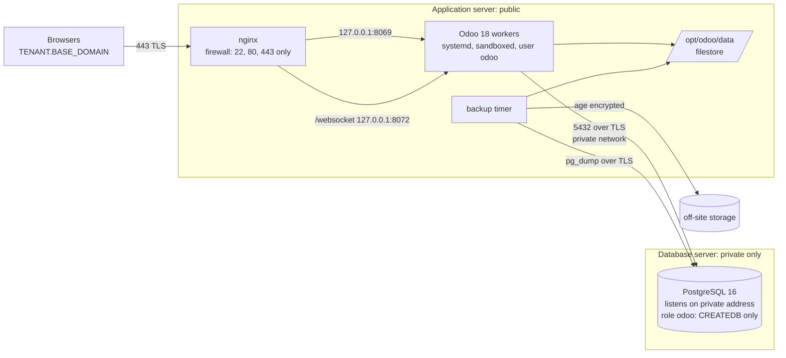

# Odoo 18 on Ubuntu 24.04 LTS: Two Server Deployment Guide

> **Purpose.** Install Odoo 18 Community as a secure, multi-tenant production service on Ubuntu 24.04, split across **two servers**: one runs the application and the web server, the other runs the database. Each tenant has its own subdomain and its own database.
>
> **Why two servers.** The database is the part that holds every tenant's data, so keeping it off the machine that faces the internet limits what an attacker who reaches the web layer can do. It also lets the two machines be sized and restarted separately. The cost is a network between them, which must be private and encrypted, and a few more moving parts to get right.
>
> **Audience.** A system administrator with sudo access on two fresh Ubuntu 24.04 servers, control of DNS for the base domain, and about three hours. You do not need to be an expert. Follow the sections in order and run the checks as you go.
>
> **Which server am I on?** Every section is labelled. Sections that apply to only one machine say so in their first line. Getting this wrong is the most common way to waste an hour here, so check the prompt before pasting.
>
> **Secrets.** This document contains no real passwords and no real domain names. Replace the placeholders listed below. Keep your completed copy in access controlled storage, never on a shared link.

---

## 0. Conventions, placeholders, and architecture

Replace these placeholders throughout:

| Placeholder | Meaning | Example |
|---|---|---|
| `BASE_DOMAIN` | Your base domain | `pheoc.example` |
| `TENANT` | Tenant subdomain **and** database name (must match exactly) | `demo` → `demo.pheoc.example`, DB `demo` |
| `ADMIN_IP` | *(optional)* admin/VPN source IP or CIDR, only if you choose to allow-list one | `203.0.113.10/32` |
| `OPS_EMAIL` | Organisational role mailbox (not a personal address) | `ops@pheoc.example` |
| `ORG/addons-repo` | Your custom-addons GitHub repository | `your-org/custom-addons` |
| `AGE_RECIPIENT` | `age` public key for backup encryption (§14) | `age1qxy...` |
| `PING_URL` | Healthcheck ping URL for backup monitoring (§14) | `https://hc-ping.com/<uuid>` |
| `APP_PRIVATE_IP` | Private address of the application server | `10.10.0.2` |
| `DB_PRIVATE_IP` | Private address of the database server | `10.10.0.3` |
| `DB_HOSTNAME` | A name **you choose** for the database server. It is not registered anywhere and needs no DNS record | `db.pheoc.example` |
| `DB_PASSWORD` | Password for the `odoo` database role (§6) | generate with `openssl rand -base64 32` |

**Which address goes where.** Two addresses are used throughout this guide and they are easy to swap by mistake, because both are private and both look alike. `listen_addresses` is the only setting that refers to the machine it is written on. Everything else refers to the *other* machine:

| Setting | Written on | Address to use |
|---|---|---|
| `listen_addresses` (§6.4) | database server | the database server's own address |
| `hostssl` line in `pg_hba.conf` (§6.4) | database server | `APP_PRIVATE_IP` |
| firewall rule for port 5432 (§3) | database server | `APP_PRIVATE_IP` |
| `/etc/hosts` line (§8.2) | application server | `DB_PRIVATE_IP` |
| `db_host` in `odoo18.conf` (§8.2) | application server | `DB_HOSTNAME`, the name, not an address |

Run `ip -4 addr show` on each machine to read its own address. If you swap the two, the symptom is usually `no pg_hba.conf entry for host` or a database that refuses to start because it cannot bind to an address that is not its own.

**The two servers must share a private network.** On a cloud provider this is a VPC or private networking option, and both machines must be in the same one. The database server needs **no public IP at all** if your provider allows that. Never carry database traffic over the public internet, even encrypted.

**Marked code blocks.** Any command block that needs editing before you run it carries a line like this immediately above it:

> 🔴 **Replace before running:** `TENANT`, `BASE_DOMAIN`

Those names are the placeholders from the table above. Blocks without that line can be pasted exactly as they appear. If you paste a marked block unchanged, the command either fails immediately or, worse, succeeds against the wrong name, so it is worth reading the line each time rather than trusting memory.

**DNS convention:** create **only** `TENANT.BASE_DOMAIN` records for tenants. **Do not create `www.TENANT.BASE_DOMAIN`**. A wildcard certificate `*.BASE_DOMAIN` matches exactly one label: it covers `demo.pheoc.example` but *cannot* cover `www.demo.pheoc.example`. The canonical hostname is the bare tenant subdomain; port 80 still catches any stray `www.` request and redirects it (no certificate needed on port 80).

**Architecture:**



**Directory layout on the application server:**

```text
/opt/odoo/
├── odoo18/            # Odoo CE source, branch 18.0
├── custom-addons/     # your addons (read-only deploy-key clone)
├── venv/              # Python virtualenv
├── data/              # data_dir: filestore, sessions  (mode 0700)
└── .ssh/              # deploy key (odoo user)
/etc/odoo/odoo18.conf              # root:odoo 0640
/etc/systemd/system/odoo18.service
/var/log/odoo/                     # odoo:odoo
/var/backups/odoo/                 # root only, 0700
/etc/odoo/db-ca.crt                # database server certificate, used to verify it
```

**Directory layout on the database server:**

```text
/etc/postgresql/16/main/server.crt   # server certificate, postgres:postgres 0644
/etc/postgresql/16/main/server.key   # private key, postgres:postgres 0600
/etc/postgresql/16/main/pg_hba.conf  # who may connect, from where, and how
```

**Sizing.** On the application server, set `workers` to about twice the number of CPU cores plus one. Allow roughly 1 GB of RAM per worker, plus headroom for the operating system. A machine with 4 cores and 16 GB gives an upper limit of 9 workers, so start lower and watch. Do not copy worker counts between servers of different sizes.

With the database on its own machine, the application server no longer needs to leave room for PostgreSQL, so it can run slightly more workers than a combined server of the same size. Give the database server plenty of RAM instead, since that is what PostgreSQL uses for caching.

**Order matters.** Hardening the SSH service and the firewall comes before any service is started, so nothing is ever exposed while unconfigured. Build the database server first, because the application server cannot be finished without it.

---

## 1. Base system

**Run this section on BOTH servers.**

Confirm you are on the release this guide was written for, before anything else:

```bash
lsb_release -d          # expect: Ubuntu 24.04
python3 --version       # expect: 3.12.x
hostname                # confirm you are on the machine you think you are
```

> **This guide targets Ubuntu 24.04, and the version matters more than it looks.** On 22.04 you get Python 3.10, and Odoo 18's requirements then select an old `gevent` that has no prebuilt package, so it is compiled from source and fails on modern build tools. You would also get nginx 1.18, which does not have the `ssl_reject_handshake` used in §10.3 and refuses to start. Neither failure mentions the Ubuntu version, so both cost an hour to trace back. Use 24.04 for the application server.

> The database server may run a different release. Nothing in §6 depends on the Ubuntu version, only on the PostgreSQL version, which appears in the paths.

```bash
sudo apt-get update && sudo apt-get -y upgrade
sudo timedatectl set-timezone UTC        # or your national TZ; keep servers consistent
timedatectl                              # check "NTP service: active". TLS and two factor codes need the right time
```

Enable **automatic security updates** (member-state servers must keep patching themselves):

```bash
sudo apt-get install -y unattended-upgrades
sudo dpkg-reconfigure -plow unattended-upgrades   # answer "Yes"
```

Verify:

```bash
cat /etc/apt/apt.conf.d/20auto-upgrades
# APT::Periodic::Update-Package-Lists "1";
# APT::Periodic::Unattended-Upgrade "1";
```

---

## 2. SSH hardening

**Run this section on BOTH servers.**

> ⚠️ **Create an administrator account before you continue, or you may lock yourself out of the server.** Many cloud images provide the `root` account only. The setting `PermitRootLogin no` below then removes the only account that can log in. The problem does not appear straight away, because reloading SSH does not close sessions that are already open. Your current session keeps working, and the lockout appears the next time the server restarts. Recovering from it requires console access through your hosting provider.
>
> 🔴 **Replace before running:** `your_admin_user`
>
> ```bash
> # Run these BEFORE the hardening block below
> # The password prompted for here is ONLY for `sudo`. SSH stays key-only:
> # PasswordAuthentication no means it can never be used to log in remotely.
> sudo adduser --gecos "" your_admin_user
> sudo usermod -aG sudo your_admin_user
> sudo install -d -m 700 -o your_admin_user -g your_admin_user /home/your_admin_user/.ssh
> sudo cp /root/.ssh/authorized_keys /home/your_admin_user/.ssh/authorized_keys
> sudo chown your_admin_user:your_admin_user /home/your_admin_user/.ssh/authorized_keys
> sudo chmod 600 /home/your_admin_user/.ssh/authorized_keys
>
> # Prove the key actually landed. If this is empty, paste your PUBLIC key in
> # by hand. Continuing with an empty file is how lockouts happen.
> sudo test -s /home/your_admin_user/.ssh/authorized_keys && echo "key present" || echo "EMPTY: fix this before continuing"
> ```
>
> Now open a **second terminal window** and log in as the new user, leaving your first session connected. Do not continue until this works:
>
> 🔴 **Replace before running:** `your_admin_user`, `your_key`
>
> ```bash
> ssh -o IdentitiesOnly=yes -i ~/.ssh/your_key your_admin_user@server
> sudo -v          # must succeed: confirms sudo rights
> ```
>
> Apply the settings below only after that second session works, and keep the first session open until you have logged in again successfully. If you must keep root access over SSH, use `PermitRootLogin prohibit-password`, which accepts keys but refuses passwords. Plain `no` blocks root even when the key is correct.
>
> A passphrase prompt does not mean the server has accepted you. The passphrase unlocks the key file on your own computer, and the server never sees it. Being asked for it and then refused is normal when the account itself is not permitted.

🔴 **Replace before running:** `your_admin_user`

```bash
sudo tee /etc/ssh/sshd_config.d/99-hardening.conf > /dev/null <<'EOF'
PermitRootLogin no
PasswordAuthentication no
KbdInteractiveAuthentication no
X11Forwarding no
MaxAuthTries 3
LoginGraceTime 30
# Optional, stricter: allow only named admin accounts to SSH in.
# AllowUsers your_admin_user
EOF
sudo sshd -t || { echo "sshd config is INVALID, not reloading"; false; }
sudo systemctl reload ssh 2>/dev/null || sudo systemctl restart ssh.socket
```

> **Note.** On Ubuntu 24.04 the SSH service starts on demand. `ssh.socket` is enabled and `ssh.service` stays inactive until someone connects, so `systemctl reload ssh` on its own reports `ssh.service is not active, cannot reload` and returns an error. The command above handles both arrangements. The settings still take effect, because each new connection starts a fresh `sshd` that reads the configuration file.

Confirm the settings are actually live (this shows the settings actually in force). Do this **before** you close your current session:

```bash
sudo sshd -T | grep -Ei '^(permitrootlogin|passwordauthentication|kbdinteractiveauthentication|x11forwarding|maxauthtries|logingracetime)'
```

> **If you see "Too many authentication failures" on your first attempt,** the cause is `MaxAuthTries 3` combined with a client that offers every key it holds. Each key counts as one attempt, so three unrelated keys use up the limit before the correct key is tried. It looks like a wrong passphrase, but it is not. Correct this on your own computer rather than raising the limit on the server:
>
> ```bash
> ssh -o IdentitiesOnly=yes -i ~/.ssh/the_right_key user@server
> ```
>
> Make it permanent in your local `~/.ssh/config`:
>
> 🔴 **Replace before running:** `your_admin_user`
>
> ```text
> Host server.example
>   User your_admin_user
>   IdentityFile ~/.ssh/the_right_key
>   IdentitiesOnly yes
> ```

Where feasible (cloud security groups, national network policy), additionally restrict SSH **source IPs** to your admin ranges or place SSH behind a VPN/bastion.

---

## 3. Firewall and fail2ban

The two servers expose different things, so the rules differ. Install the packages on both:

```bash
sudo apt-get install -y ufw fail2ban
```

**On the application server**, only ports 22, 80 and 443 are ever exposed. SSH is rate limited by the firewall:

```bash
sudo ufw default deny incoming
sudo ufw default allow outgoing
sudo ufw limit 22/tcp              # slows down password guessing
sudo ufw allow 80/tcp              # certificate validation and redirect to HTTPS
sudo ufw allow 443/tcp             # HTTPS
sudo ufw enable
sudo ufw status verbose
```

**On the database server**, nothing is exposed to the internet at all. PostgreSQL accepts connections only from the application server's private address:

🔴 **Replace before running:** `APP_PRIVATE_IP`

```bash
sudo ufw default deny incoming
sudo ufw default allow outgoing
sudo ufw limit 22/tcp                            # administration only
sudo ufw allow from APP_PRIVATE_IP to any port 5432 proto tcp
sudo ufw enable
sudo ufw status verbose
```

> **Check the database rule names a single address, not a range.** `sudo ufw status` must show port 5432 allowed `from APP_PRIVATE_IP` and from nowhere else. A rule reading `Anywhere` on 5432 exposes every tenant's data to the whole private network, and on some providers that network is shared with other customers. This is the single most important rule on that machine.
>
> If your provider lets you remove the public IP from the database server entirely, do that as well. A firewall rule protects a port that exists; no public address means there is nothing to reach in the first place.

> **Use the port numbers shown above, not `ufw allow 'Nginx Full'`.** That profile is supplied by the nginx package, which is not installed until §10. Running the named version here fails with `ERROR: Could not find a profile matching 'Nginx Full'`, and because the next line enables the firewall anyway, ports 80 and 443 are left closed. The effect appears much later, as failed certificate validation and unreachable tenants. The numeric rules do the same job and work at any stage.

Baseline fail2ban, on **both** servers. The Odoo login jail is added in §13 and belongs on the application server only, because that is where Odoo writes its log:

```bash
sudo tee /etc/fail2ban/jail.local > /dev/null <<'EOF'
[DEFAULT]
bantime  = 1h
findtime = 10m
maxretry = 5

[sshd]
enabled = true
EOF
sudo systemctl enable --now fail2ban
```

---

## 4. Service user and directories

**Application server only.**

```bash
sudo adduser --system --home=/opt/odoo --group odoo   # --system => no login shell
sudo chown odoo:odoo /opt/odoo
sudo -u odoo mkdir -p /opt/odoo/data /opt/odoo/.ssh
sudo mkdir -p /etc/odoo /var/log/odoo /var/backups/odoo
sudo chown odoo:odoo /var/log/odoo
sudo chmod 700 /opt/odoo/.ssh /opt/odoo/data /var/backups/odoo
```

> The `data/` directory is set to `0700` because it holds the filestore, which contains every uploaded document, and the session tokens. Nothing else on the server needs to read it. Backups run as root and are not affected by these permissions. Code under `/opt/odoo` belongs to the `odoo` user and is not group writable. Apply changes with the procedure in §15.2 rather than editing files in place. Development setups belong on development machines.

---

## 5. Dependencies

**Application server only.**

### 5.1 System packages

```bash
sudo apt-get install -y git python3 python3-dev python3-pip python3-venv \
  build-essential wget libxslt1-dev libzip-dev libldap2-dev libsasl2-dev \
  libpq-dev libjpeg-dev libxml2-dev libssl-dev libffi-dev zlib1g-dev \
  liblcms2-dev libblas-dev libatlas-base-dev

# Client tools only, no database server on this machine. pg_dump, pg_restore
# and psql are needed for the backups in §14 and for checking the connection.
sudo apt-get install -y postgresql-client
```

> If the two machines run different PostgreSQL versions, install the client that matches the **server**, or at least a newer one. `pg_dump` from a newer client can read an older server, but an older client cannot read a newer one and will refuse to run.
>
> The application server gets `postgresql-client`, **not** `postgresql`. Installing the full package here would start a second, unused database on this machine, which is one more thing to patch and one more way to connect to the wrong database by accident.

### 5.2 Node and rtlcss

Odoo 18 needs **rtlcss** for right-to-left languages (required for Arabic-language tenants). The legacy `less`/`node-less` tooling and the `/usr/bin/nodejs` symlink from older guides are **not** used by Odoo 18. Leave them out.

```bash
sudo apt-get install -y npm
sudo npm install -g rtlcss
```

### 5.3 wkhtmltopdf (patched Qt build)

The Ubuntu-repo build lacks the patched Qt, breaking PDF headers/footers. Install the project's patched build (the jammy package installs cleanly on 24.04):

```bash
wget https://github.com/wkhtmltopdf/packaging/releases/download/0.12.6.1-3/wkhtmltox_0.12.6.1-3.jammy_amd64.deb
sudo apt-get install -y ./wkhtmltox_0.12.6.1-3.jammy_amd64.deb
wkhtmltopdf --version    # must say: 0.12.6.1 (with patched qt)
rm wkhtmltox_0.12.6.1-3.jammy_amd64.deb
```

> If this package will not install on your architecture, use `apt-get install wkhtmltopdf` instead and accept that report headers and footers will be limited. Record the difference in your server notes.

---

## 6. Database server

**Database server only.** Complete this section before starting §7, because the application server cannot connect until it is done.

### 6.1 Install PostgreSQL

```bash
sudo apt-get install -y postgresql
psql --version        # expect 16.x on Ubuntu 24.04
```

### 6.2 Create the odoo role with a password

On a single server, Odoo connects over a local socket and the operating system proves who it is, so no password is needed. Across two machines that is no longer possible, so the role needs a real password.

🔴 **Replace before running:** `DB_PASSWORD`

```bash
openssl rand -base64 32        # copy this, it is DB_PASSWORD
```

🔴 **Replace before running:** `DB_PASSWORD`

```bash
sudo -u postgres psql -c "CREATE ROLE odoo WITH LOGIN CREATEDB PASSWORD 'DB_PASSWORD';"
sudo -u postgres psql -c '\du'
```

> 🔒 **Never give the odoo role SUPERUSER rights.** Odoo needs only `CREATEDB`. With superuser rights, a compromised Odoo or a single faulty addon could read or delete every tenant database, and could run operating system commands as the `postgres` user through `COPY ... FROM PROGRAM`. The `odoo` row in the output above must show `Create DB` and nothing else. To correct an existing server, run `sudo -u postgres psql -c 'ALTER USER odoo WITH NOSUPERUSER;'`
>
> Store `DB_PASSWORD` in your secrets manager. It is written into `/etc/odoo/odoo18.conf` on the application server in §8.2, which is why that file is readable only by root and the `odoo` user.

### 6.3 Create the server certificate

Traffic between the two machines must be encrypted, and the application server must be able to prove it is talking to the right database rather than to something that has taken over that address. A certificate the database presents, and that the application server checks, does both.

**`DB_HOSTNAME` is a name you make up.** You do not buy it, register it, or add it to public DNS, and your hosting provider has nothing to do with it. Choose something descriptive, such as `db.pheoc.example`, and use the identical spelling in all three of the places that follow:

1. the certificate created below,
2. the `/etc/hosts` line on the application server (§8.2),
3. `db_host` in `/etc/odoo/odoo18.conf` (§8.2).

Nothing else needs to know it exists. The application server is the only machine that looks it up, and §8.2 tells it the address directly.

Name the certificate after `DB_HOSTNAME` rather than after an IP address. The application server checks the certificate against whatever is written in `db_host`, so if that is an address, the certificate stops matching as soon as the server is rebuilt with a different one. A name survives that: you change one line in `/etc/hosts` and everything else keeps working.

🔴 **Replace before running:** `DB_HOSTNAME`

```bash
sudo openssl req -new -x509 -days 3650 -nodes -newkey rsa:4096 \
  -subj "/CN=DB_HOSTNAME" -addext "subjectAltName=DNS:DB_HOSTNAME" \
  -keyout /etc/postgresql/16/main/server.key \
  -out   /etc/postgresql/16/main/server.crt

sudo chown postgres:postgres /etc/postgresql/16/main/server.key /etc/postgresql/16/main/server.crt
sudo chmod 600 /etc/postgresql/16/main/server.key
sudo chmod 644 /etc/postgresql/16/main/server.crt
```

> If you would rather use the private address directly and skip the `/etc/hosts` line, that also works, but the certificate must then name the address instead: replace both `DB_HOSTNAME` values above with `DB_PRIVATE_IP`, and change `-addext "subjectAltName=DNS:DB_HOSTNAME"` to `-addext "subjectAltName=IP:DB_PRIVATE_IP"`. Set `db_host = DB_PRIVATE_IP` in §8.2 to match. Be aware that you will have to reissue this certificate every time the database server's address changes.
>
> This certificate signs itself, which is the right choice here. There are exactly two machines involved, you control both, and the application server will be given a copy of this exact certificate to check against in §8.2. A certificate authority adds moving parts without adding security at this scale. Note the ten year lifetime: put its expiry date in the same inventory as your other certificates, because nothing will remind you.

### 6.4 Listen on the private network and require TLS

**Find the private address first.** A cloud server usually has two addresses: a public one, which is the one you use to log in, and a private one on the network it shares with your other machines. `DB_PRIVATE_IP` is the private one. Using the public address by mistake puts PostgreSQL on the internet, and it will not look wrong in any of the checks that follow unless you know which address to expect.

```bash
ip -4 addr show | grep inet
```

Private addresses start with `10.`, or `172.` followed by 16 through 31, or `192.168.`. Anything else is public. If only one address is listed and it is public, your two servers are not on a private network yet, and you should set that up with your provider before continuing rather than exposing the database.

🔴 **Replace before running:** `DB_PRIVATE_IP`

```bash
sudo -u postgres psql -c "ALTER SYSTEM SET listen_addresses = 'DB_PRIVATE_IP';"
sudo -u postgres psql -c "ALTER SYSTEM SET password_encryption = 'scram-sha-256';"
sudo -u postgres psql -c "ALTER SYSTEM SET ssl = on;"
sudo -u postgres psql -c "ALTER SYSTEM SET ssl_cert_file = '/etc/postgresql/16/main/server.crt';"
sudo -u postgres psql -c "ALTER SYSTEM SET ssl_key_file  = '/etc/postgresql/16/main/server.key';"
```

`ALTER SYSTEM` writes these settings to a file PostgreSQL always reads last, so they cannot be lost in the main configuration file or overwritten by a package upgrade.

Now say who may connect. PostgreSQL reads these rules from top to bottom and uses the first one that matches, so this line is added at the end, after the default rules that cover connections made on the database server itself:

🔴 **Replace before running:** `APP_PRIVATE_IP`

```bash
sudo tee -a /etc/postgresql/16/main/pg_hba.conf > /dev/null <<'EOF'

# Odoo application server: TLS required, password authentication.
hostssl all             odoo            APP_PRIVATE_IP/32       scram-sha-256
EOF

sudo systemctl restart postgresql
pg_lsclusters
```

> ⚠️ **Check `pg_lsclusters`, not `systemctl status postgresql`.** On Debian and Ubuntu, `postgresql.service` is an empty wrapper whose only job is to succeed, so it reports `active (exited)` even when the database itself failed to start and nothing is listening. The real unit is `postgresql@VERSION-main`. `pg_lsclusters` shows the truth in one line: the `Status` column must read `online`.
>
> If it says `down`, the reason is in the cluster's own log, which is the only place it appears:
>
> ```bash
> sudo tail -30 /var/log/postgresql/postgresql-16-main.log
> ```
>
> The three failures that follow from this section are: `could not load server certificate file`, meaning the paths in §6.4 do not match where §6.3 wrote the files; `private key file has group or world access`, meaning `server.key` is not `0600` and owned by `postgres`; and `Cannot assign requested address`, meaning `listen_addresses` names an address this machine does not have.

> The first word is `hostssl`, not `host`. With `host`, PostgreSQL accepts the connection whether or not it is encrypted, so a misconfigured client silently sends every query and every row of patient data across the network in the clear. With `hostssl` an unencrypted connection is refused outright.
>
> Every path in this section contains the PostgreSQL major version. This guide uses 16, which is what Ubuntu 24.04 installs. If your database server runs a different release, `pg_lsclusters` shows the version in its first column, and every `/etc/postgresql/16/main/` path below becomes that number instead. The `ALTER SYSTEM` commands do not contain paths, but the two `ssl_cert_file` and `ssl_key_file` values do, and they must match where §6.3 actually wrote the files.
>
> Running the block above twice adds a second identical line. That is harmless, because the first match wins, but check with `grep hostssl /etc/postgresql/16/main/pg_hba.conf` if you are unsure.

### 6.5 Check it before leaving this machine

🔴 **Replace before running:** `DB_PRIVATE_IP`

```bash
pg_lsclusters                                         # Status must be online
sudo -u postgres psql -c "SHOW listen_addresses;"     # expect DB_PRIVATE_IP
sudo -u postgres psql -c "SHOW ssl;"                  # expect on
sudo ss -tlnp | grep 5432                             # expect DB_PRIVATE_IP:5432 only
```

> **Read the address, do not just check that one is shown.** Three results are wrong, and only the first is obvious:
>
> - `0.0.0.0` or `*` means every interface, including any public one.
> - The server's **public** address means the database is directly on the internet. This is the easy mistake, because it is the address you log in with, and nothing in the output looks unusual.
> - An address that is not on this machine at all means PostgreSQL will fail to start.
>
> The address shown must begin with `10.`, or `172.` followed by 16 through 31, or `192.168.`. If it does not, correct `listen_addresses` and restart before continuing. A firewall rule is a second line of defence, not a reason to leave the database listening where it should not be.

Optional performance tuning, once the deployment works: raise `shared_buffers` to about 25% of the machine's RAM and `effective_cache_size` to about 50 to 75%, then restart PostgreSQL. With the database on its own server these settings matter more than they do on a shared machine, because there is nothing else competing for memory.

### 6.6 Copy the certificate to the application server

The application server needs a copy of `server.crt` to check the database's identity. Copy it there now, for example with `scp` from your own computer, and place it at `/etc/odoo/db-ca.crt` on the application server. §8.2 uses it.

```bash
# on the DATABASE server, display it:
sudo cat /etc/postgresql/16/main/server.crt
```

Only the certificate is copied. The key file `server.key` never leaves the database server.

---

## 7. Odoo source, custom addons, and Python environment

**Application server only.**

### 7.1 Odoo 18 Community

```bash
sudo -u odoo git clone https://github.com/odoo/odoo --depth 1 --branch 18.0 --single-branch /opt/odoo/odoo18
```

### 7.2 Custom addons via a read-only deploy key

Do **not** put a personal GitHub account's SSH key on servers. Create a **per-server, per-repo, read-only deploy key**. It can be revoked on its own, and it grants nothing beyond that one repository:

```bash
sudo -u odoo ssh-keygen -t ed25519 -N "" \
  -f /opt/odoo/.ssh/id_ed25519_deploy -C "odoo-deploy@$(hostname)"
sudo -u odoo cat /opt/odoo/.ssh/id_ed25519_deploy.pub
```

Copy the public key → GitHub → **your repo** → *Settings → Deploy keys → Add deploy key* → leave **"Allow write access" unchecked**.

Pin GitHub's SSH host key so the first clone can't be silently intercepted (compare the scanned key against GitHub's published fingerprints. The ed25519 one is `SHA256:+DiY3wvvV6TuJJhbpZisF/zLDA0zPMSvHdkr4UvCOqU`):

```bash
sudo -u odoo sh -c 'ssh-keyscan -t ed25519 github.com >> /opt/odoo/.ssh/known_hosts'
sudo -u odoo ssh-keygen -lf /opt/odoo/.ssh/known_hosts     # verify fingerprint matches GitHub's docs
```

```bash
sudo -u odoo tee /opt/odoo/.ssh/config > /dev/null <<'EOF'
Host github.com
  User git
  IdentityFile /opt/odoo/.ssh/id_ed25519_deploy
  IdentitiesOnly yes
EOF
sudo -u odoo chmod 600 /opt/odoo/.ssh/config

sudo -u odoo git clone git@github.com:borse/ePHEM.git \
  --depth 1 --branch 18_national_dev --single-branch /opt/odoo/custom-addons
```

> Use the branch you run in production. Keep development branches on development machines.

### 7.3 Virtualenv and requirements

Install the requirements supplied with the branch you cloned. Never replace `requirements.txt` with a copy pasted from a document, because it will not match the version you are running:

```bash
sudo -u odoo python3 -m venv /opt/odoo/venv
sudo -u odoo /opt/odoo/venv/bin/pip install --upgrade pip wheel
sudo -u odoo /opt/odoo/venv/bin/pip install -r /opt/odoo/odoo18/requirements.txt
```

> **Custom addons are not installed with `pip`.** An Odoo addon is not a Python package. Odoo loads addons from the directories listed in `addons_path` (§8.2), so copying the repository to `/opt/odoo/custom-addons` in §7.2 is all that is needed to install the code itself. The virtualenv holds something different: the third party Python libraries that those addons import, such as pandas or pysftp. The addon code sits on disk, and its Python dependencies sit in the virtualenv.

Those extra libraries are **pinned** and tracked in the addons repo as `requirements-custom.txt`, e.g.:

```text
pandas==2.2.3
pysftp==0.2.9
google-auth==2.35.0
```

Install them into the Odoo virtualenv. Always use `/opt/odoo/venv/bin/pip` and never the system `pip`, otherwise Odoo will not find the libraries:

Run this as your administrator account, not as `odoo`. The `odoo` account created in §4 is a system account with no sudo rights, so running `sudo -u odoo` while logged in as `odoo` fails with `odoo is not in the sudoers file`.

```bash
if sudo test -f /opt/odoo/custom-addons/requirements-custom.txt; then
    sudo -u odoo /opt/odoo/venv/bin/pip install \
        -r /opt/odoo/custom-addons/requirements-custom.txt
else
    echo "NOTE: the addons repository has no requirements-custom.txt. Read the note below."
fi
```

> **The test uses `sudo test -f`, not plain `[ -f ... ]`, and the difference matters.** `/opt/odoo` is owned by `odoo` with mode `0750` (§4), so your administrator account cannot look inside it at all. A plain `[ -f ... ]` then returns false because it was refused permission, not because the file is missing, and the message below would blame the wrong thing. Running the test through `sudo` gives it the access it needs. If you want to see the file for yourself:
>
> ```bash
> sudo ls -l /opt/odoo/custom-addons/requirements-custom.txt
> ```

> **Why this uses `if` and `else`.** Written as a single line with `&&` and `||`, the final branch also runs when the installation itself fails, so a broken dependency would be reported as a missing file and send you looking in the wrong place. The full path is written out rather than stored in a shell variable, because copying only part of a two line block leaves the variable empty, and the check then reports the file as missing when it is present.

> **If the file does not exist, check whether it should.** Either the addons genuinely need no extra libraries, or nobody has written the file yet. In the second case the installation appears to succeed and then fails later with `ModuleNotFoundError`, the first time somebody opens the affected feature. To build the list from the addons themselves:
>
> ```bash
> # run in a checkout of the addons repo; lists third-party imports to review
> python3 - <<'PY'
> import ast, pathlib, sys, collections
> stdlib = set(sys.stdlib_module_names)
> uses = collections.defaultdict(set)
> for f in pathlib.Path(".").rglob("*.py"):
>     try: tree = ast.parse(f.read_text(encoding="utf-8", errors="ignore"))
>     except SyntaxError: continue
>     for n in ast.walk(tree):
>         names = ([a.name.split(".")[0] for a in n.names] if isinstance(n, ast.Import)
>                  else [(n.module or "").split(".")[0]] if isinstance(n, ast.ImportFrom) and n.level == 0
>                  else [])
>         for m in names:
>             if m and m not in stdlib and m not in {"odoo", "openerp", "addons", ""}:
>                 uses[m].add(str(f).split("/")[0])
> for m in sorted(uses): print("%-24s %s" % (m, ", ".join(sorted(uses[m])[:3])))
> PY
> ```
>
> Compare the result with the libraries Odoo already installs, which you can list with `/opt/odoo/venv/bin/pip list`, and ignore anything imported only by development tools. Fix a version for everything that remains. Some libraries also need a system package before they will load. For example, `python-magic` needs `libmagic1`. Record those alongside the version.

---

## 8. Odoo configuration

**Application server only.**

### 8.1 Generate the master password

```bash
openssl rand -base64 32
```

Store the value in your secrets manager. This password gates database create/duplicate/**backup/restore/drop** for every tenant, so it must be long, random, unique to this server, and never written into a shared document. (Optionally, after first start, set it via *Database manager → Set master password* so Odoo stores a PBKDF2 **hash** in the config instead of plaintext.)

### 8.2 `/etc/odoo/odoo18.conf`

```bash
sudo nano /etc/odoo/odoo18.conf
```

🔴 **Replace before running:** `DB_HOSTNAME`, `DB_PASSWORD`, `REPLACE_WITH_GENERATED_SECRET`

```ini
[options]
; =====================================================================
; Odoo 18 production. This file contains secrets: root:odoo, mode 0640
; =====================================================================

; Master password for the database manager (generate: openssl rand -base64 32)
admin_passwd = REPLACE_WITH_GENERATED_SECRET

; --- Database (separate server, TLS required) -------------------------
; db_sslmode = verify-full means: encrypt the connection AND check that
; the certificate the database presents was issued for db_host. Anything
; weaker accepts a machine that has taken over that address.
db_host = DB_HOSTNAME
db_port = 5432
db_user = odoo
db_password = DB_PASSWORD
db_sslmode = verify-full

; Hide the database list & manager from the web entirely.
list_db = False

; Multi-tenant routing: serve EXACTLY the database named after the
; subdomain. The pattern is anchored. An unanchored %d would match any
; database merely CONTAINING the subdomain, such as "som" matching "somalia".
; Rule: database name == subdomain, always.
dbfilter = ^%d$

; --- Paths ------------------------------------------------------------
addons_path = /opt/odoo/odoo18/addons,/opt/odoo/custom-addons
data_dir = /opt/odoo/data

; --- Network: current option names; bind to loopback ONLY -------------
; (the old xmlrpc_*, netrpc_* and longpolling_* names no longer work)
http_interface = 127.0.0.1
http_port = 8069
gevent_port = 8072
proxy_mode = True

; --- Workers & limits: SIZE PER HOST (workers ≈ 2×CPU + 1) ------------
workers = 5
max_cron_threads = 2
limit_memory_soft = 2147483648
limit_memory_hard = 2684354560
limit_request = 8192
limit_time_cpu = 120
limit_time_real = 240
; Raise the two time limits only if specific long reports require it.

; --- Logging -----------------------------------------------------------
logfile = /var/log/odoo/odoo18.log
log_level = info
```

The application server has to resolve `DB_HOSTNAME` to the private address, and has to trust the certificate created in §6.3. Set both up now:

🔴 **Replace before running:** `DB_HOSTNAME`, `DB_PRIVATE_IP`

```bash
# Map the internal name to the private address
echo "DB_PRIVATE_IP  DB_HOSTNAME" | sudo tee -a /etc/hosts

# Install the certificate copied from the database server in §6.6
sudo tee /etc/odoo/db-ca.crt > /dev/null <<'EOF'
-----BEGIN CERTIFICATE-----
PASTE THE CONTENTS OF server.crt FROM THE DATABASE SERVER HERE
-----END CERTIFICATE-----
EOF
sudo chmod 644 /etc/odoo/db-ca.crt

# The odoo user's database client looks here by default, so a manually run
# odoo-bin finds the certificate without any extra settings
sudo -u odoo mkdir -p /opt/odoo/.postgresql
sudo ln -sfn /etc/odoo/db-ca.crt /opt/odoo/.postgresql/root.crt
sudo chown -h odoo:odoo /opt/odoo/.postgresql/root.crt
```

Check the connection before going any further. Nothing later in this guide can work until this succeeds:

🔴 **Replace before running:** `DB_HOSTNAME`

```bash
sudo -u odoo psql "host=DB_HOSTNAME user=odoo dbname=postgres sslmode=verify-full" -c "SELECT version();"
```

> **What the failures mean.**
>
> | Message | Cause |
> |---|---|
> | `could not translate host name` | The `/etc/hosts` line is missing or misspelled. |
> | `connection refused` | PostgreSQL is not listening on the private address (§6.4), or the firewall rule on the database server does not name this machine (§3). |
> | `no pg_hba.conf entry for host` | The `hostssl` line does not match this server's private address. Check that `APP_PRIVATE_IP` in §6.4 is the address this machine actually uses on the private network, which `ip -4 addr` will show. |
> | `server does not support SSL` | `ssl` is not on. Recheck §6.4. |
> | `certificate verify failed` | `/etc/odoo/db-ca.crt` does not match the certificate on the database server, or it was copied incompletely. |
> | `server certificate for "X" does not match host name "Y"` | The certificate was issued for a different name than `db_host`. Both must be `DB_HOSTNAME`. |
> | `password authentication failed` | `DB_PASSWORD` differs between the role created in §6.2 and the configuration file. |

Lock the file down (an editor may create it readable by everyone, with the master password and now the database password inside):

```bash
sudo chown root:odoo /etc/odoo/odoo18.conf
sudo chmod 640 /etc/odoo/odoo18.conf
```

### 8.3 Log rotation

```bash
sudo tee /etc/logrotate.d/odoo > /dev/null <<'EOF'
/var/log/odoo/*.log {
    daily
    rotate 30
    compress
    delaycompress
    missingok
    notifempty
    copytruncate
}
EOF
```

---

## 9. systemd service (hardened)

**Application server only.**

```bash
sudo nano /etc/systemd/system/odoo18.service
```

```ini
[Unit]
Description=Odoo 18 (production)
After=network-online.target
Wants=network-online.target

[Service]
Type=simple
User=odoo
Group=odoo
SyslogIdentifier=odoo18
ExecStart=/opt/odoo/venv/bin/python3 /opt/odoo/odoo18/odoo-bin -c /etc/odoo/odoo18.conf
Restart=on-failure
RestartSec=5
KillMode=mixed
TimeoutStopSec=30
UMask=0027
LimitNOFILE=65536

# Writable scratch/cache inside the sandbox (fontconfig, wkhtmltopdf, etc.)
CacheDirectory=odoo
Environment=XDG_CACHE_HOME=/var/cache/odoo

# Certificate used to verify the database server (§6.3)
Environment=PGSSLROOTCERT=/etc/odoo/db-ca.crt

# ---- Sandboxing: limits what a compromised Odoo process can touch ----
# ProtectSystem=strict makes the ENTIRE filesystem read-only to this unit
# except ReadWritePaths. Net effect: even though the odoo user owns the
# source tree, the running process CANNOT modify its own code, which
# blocks an attacker from making changes that survive a restart. Deploys (git pull)
# happen outside the unit (§15.2) and are unaffected.
NoNewPrivileges=true
PrivateTmp=true
PrivateDevices=true
ProtectSystem=strict
ProtectHome=true
ReadWritePaths=/opt/odoo/data /var/log/odoo
ProtectKernelModules=true
ProtectKernelTunables=true
ProtectKernelLogs=true
ProtectControlGroups=true
ProtectClock=true
ProtectHostname=true
ProtectProc=invisible
RestrictAddressFamilies=AF_UNIX AF_INET AF_INET6
RestrictNamespaces=true
RestrictRealtime=true
RestrictSUIDSGID=true
LockPersonality=true
RemoveIPC=true
CapabilityBoundingSet=
AmbientCapabilities=
SystemCallArchitectures=native
SystemCallFilter=@system-service
SystemCallFilter=~@privileged
# A blocked syscall returns an error instead of killing the process outright.
# Without this, anything the filter rejects dies from SIGSYS with no log line
# and no traceback, which is extremely hard to diagnose.
SystemCallErrorNumber=EPERM

[Install]
WantedBy=multi-user.target
```

> **There is no `Requires=postgresql.service` here,** unlike a single server installation. That unit does not exist on this machine, and naming it would stop Odoo from ever starting. The database is reached over the network instead, so if it is unavailable at boot Odoo will fail and `Restart=on-failure` will retry every five seconds until it answers. That is the behaviour you want: the application server recovers on its own once the database returns, without anyone logging in.
>
> **`@resources` is deliberately not blocked.** An earlier version of this unit denied it, which killed Odoo's scheduled task workers on startup: they call `setpriority` through `os.nice()` to run at lower priority, and that syscall belongs to `@resources`. A blocked syscall kills the process with `SIGSYS`, which writes nothing to any Odoo log, so the only visible symptom was workers restarting several times a second and `502 Bad Gateway` from nginx. The evidence appears only in the kernel audit trail:
>
> ```bash
> sudo dmesg -T | grep -E 'seccomp|syscall=' | tail
> ```
>
> A line containing `sig=31` is a process killed by the system call filter, and the `syscall=` number identifies which call was refused. `SystemCallErrorNumber=EPERM` above changes this behaviour, so a future mismatch produces a normal error the application can report rather than a silent death.

> If an addon needs to write somewhere else, add that path to `ReadWritePaths` rather than weakening the sandbox. If the service does not start, check `journalctl -u odoo18`. Permission errors mean a path is missing from `ReadWritePaths`. If a process dies with no error at all, check `sudo dmesg -T | grep syscall=` for a system call filter kill before changing anything else. Changing `ProtectSystem=strict` to `ProtectSystem=full` is a last resort.

Start and verify:

```bash
sudo systemctl daemon-reload
sudo systemctl enable --now odoo18
sudo systemctl status odoo18
sudo journalctl -u odoo18 -n 50
```

**Required check. Odoo must listen on the local interface only:**

```bash
ss -tlnp | grep -E ':8069|:8072'
# both lines must show 127.0.0.1, never 0.0.0.0 or [::]
```

(The firewall also blocks 8069 and 8072 from outside, but check this anyway.)

---

## 10. nginx reverse proxy

**Application server only.**

```bash
sudo apt-get install -y nginx
```

### 10.1 Shared snippets

ACME challenge location:

```bash
sudo mkdir -p /var/lib/letsencrypt/.well-known
sudo chgrp www-data /var/lib/letsencrypt
sudo chmod g+s /var/lib/letsencrypt

sudo tee /etc/nginx/snippets/letsencrypt.conf > /dev/null <<'EOF'
location ^~ /.well-known/acme-challenge/ {
  allow all;
  root /var/lib/letsencrypt/;
  default_type "text/plain";
  try_files $uri =404;
}
EOF
```

TLS settings. OCSP stapling lines are not included, because Let's Encrypt stopped providing OCSP in 2025 and they would have no effect. The `resolver` line went with them. If you add a resolver later, point it at `127.0.0.53` or your national resolver rather than a public DNS service in another country:

```bash
sudo openssl dhparam -out /etc/ssl/certs/dhparam.pem 2048

sudo tee /etc/nginx/snippets/ssl.conf > /dev/null <<'EOF'
ssl_dhparam /etc/ssl/certs/dhparam.pem;

ssl_session_timeout 1d;
ssl_session_cache shared:SSL:10m;
ssl_session_tickets off;

ssl_protocols TLSv1.2 TLSv1.3;
ssl_ciphers ECDHE-ECDSA-AES128-GCM-SHA256:ECDHE-RSA-AES128-GCM-SHA256:ECDHE-ECDSA-AES256-GCM-SHA384:ECDHE-RSA-AES256-GCM-SHA384:ECDHE-ECDSA-CHACHA20-POLY1305:ECDHE-RSA-CHACHA20-POLY1305:DHE-RSA-AES128-GCM-SHA256:DHE-RSA-AES256-GCM-SHA384;
ssl_prefer_server_ciphers off;

# `always` on EVERY header: without it, nginx emits the header only on
# 2xx/3xx replies, so 403/404/500/502 pages ship with no clickjacking or
# nosniff protection at all. The blocked /web/database/* and RPC replies
# in §12 are exactly such responses.
add_header Strict-Transport-Security "max-age=63072000; includeSubDomains" always;
add_header X-Frame-Options SAMEORIGIN always;
add_header X-Content-Type-Options nosniff always;
add_header Referrer-Policy strict-origin-when-cross-origin always;
EOF
```

Proxy headers snippet (used by every location that proxies to Odoo):

```bash
sudo tee /etc/nginx/snippets/odoo-proxy-headers.conf > /dev/null <<'EOF'
proxy_set_header Host $host;
proxy_set_header X-Forwarded-Host $host;
proxy_set_header X-Forwarded-For $proxy_add_x_forwarded_for;
proxy_set_header X-Forwarded-Proto $scheme;
proxy_set_header X-Real-IP $remote_addr;
EOF
```

### 10.2 Global hardening (POST-only login throttle, websocket map, no version leak)

```bash
sudo tee /etc/nginx/conf.d/odoo-hardening.conf > /dev/null <<'EOF'
server_tokens off;

# Throttle ONLY credential submissions (POST). Requests with an empty
# limit key are not counted, so GET requests for the login page are never
# limited.
# This matters because a whole office often shares one public address.
# fail2ban on *failed* logins (§13) is the real brute-force backstop.
map $request_method $odoo_login_limit_key {
  default "";
  POST    $binary_remote_addr;
}
limit_req_zone $odoo_login_limit_key zone=odoo_login:10m rate=30r/m;
limit_req_status 429;

# Websocket upgrade map (shared by all tenant sites)
map $http_upgrade $connection_upgrade {
  default upgrade;
  ''      close;
}
EOF
```

### 10.3 Catch-all default server (reject bare-IP scans, answer ACME challenges)

Internet scanners constantly probe raw IPs and random hostnames. Without a catch-all, nginx hands that traffic to your **first** tenant site, which reveals a tenant name and exposes Odoo to untargeted scanning. Close the hole and remove the stock default site:

```bash
sudo rm -f /etc/nginx/sites-enabled/default

sudo tee /etc/nginx/sites-available/00-catchall > /dev/null <<'EOF'
# Anything not addressed to a configured tenant hostname dies here.
server {
    listen 80 default_server;
    listen [::]:80 default_server;
    server_name _;

    # Serve ACME challenges for ANY hostname. The tokens are random and
    # carry no secrets, and this is what lets you issue a certificate for
    # a new tenant before that tenant's site file exists (§11). The
    # request arrives here because no other server_name matches yet.
    include snippets/letsencrypt.conf;

    # Everything else: close the connection with no response.
    # This MUST be inside `location /`, not a server-level `return 444`:
    # a server-level return runs in the rewrite phase, BEFORE location
    # selection, and would shadow the ACME location above.
    location / { return 444; }
}
server {
    # http2 is declared ONCE here, for the whole 443 socket (see note below)
    listen 443 ssl http2 default_server;
    listen [::]:443 ssl http2 default_server;
    server_name _;
    ssl_reject_handshake on;       # no certificate exposed, handshake refused
}
EOF
sudo ln -sfn /etc/nginx/sites-available/00-catchall /etc/nginx/sites-enabled/

# Load everything written in §10. Until this runs, nginx is still using the
# configuration it started with, including the default site.
sudo nginx -t && sudo systemctl reload nginx
```

> **Do not skip the reload.** Sections 10.1 to 10.3 only write files. nginx keeps serving whatever it loaded when it started until it is told to re-read them, so the certificate step in §11 would still meet the stock default site and its challenge would be answered with a 404. Writing a configuration file and reloading the service are two separate actions, and `nginx -t` performs neither: it checks the files on disk and changes nothing about the running service.

> **Why `http2` is set here and not in each tenant file.** On nginx 1.24, the version supplied with Ubuntu 24.04, `http2` belongs to the listening socket rather than to an individual server block, so it only needs to appear once for each address and port. Repeating it in every tenant file makes `nginx -t` print `protocol options redefined for 0.0.0.0:443` from the second tenant onwards. Setting it in the catch all file, which loads first because of the `00-` prefix, enables HTTP/2 for every tenant. Do not use the newer `http2 on;` directive, because nginx 1.24 does not recognise it and will refuse to start.

## 11. TLS certificates

**Preferred option: one wildcard certificate** for `*.BASE_DOMAIN`, issued with DNS validation. This decouples certificates from tenants entirely: adding a member state never touches certbot, one broken tenant DNS zone can't block renewal for everyone, and the certificate no longer publishes your full tenant inventory. (Per-tenant certificates are the fallback where DNS-01 automation isn't possible; locally-hosted states with their own domains simply issue their own cert with the same procedure.)

```bash
sudo apt-get install -y certbot
```

**Pick one of the two options below, not both.** Option A issues a single certificate covering every tenant. Option B issues one per tenant. Either works on its own.

🟠 **OPTION A, one wildcard certificate (DNS validation).** Install the plugin for your DNS provider. Cloudflare is used as the example, and plugins exist for most providers. If yours is not supported, use `--manual --preferred-challenges dns`, or acme.sh with your provider's API:

🔴 **Replace before running:** `BASE_DOMAIN`, `OPS_EMAIL`, `REPLACE_WITH_SCOPED_DNS_TOKEN`

```bash
sudo apt-get install -y python3-certbot-dns-cloudflare
sudo mkdir -p /root/.secrets
sudo tee /root/.secrets/dns-creds.ini > /dev/null <<'EOF'
dns_cloudflare_api_token = REPLACE_WITH_SCOPED_DNS_TOKEN
EOF
sudo chmod 600 /root/.secrets/dns-creds.ini

sudo certbot certonly \
  --dns-cloudflare --dns-cloudflare-credentials /root/.secrets/dns-creds.ini \
  -d "BASE_DOMAIN" -d "*.BASE_DOMAIN" \
  --agree-tos -m OPS_EMAIL --no-eff-email \
  --deploy-hook "systemctl reload nginx"
```

> Limit the DNS API token to editing DNS for this one zone. The token can complete domain validation, so treat it with the same care as a credential that issues certificates.

🟠 **OPTION B, one certificate per tenant (HTTP-01 webroot).** The catch all file from §10.3 already answers validation requests for any hostname on port 80, so no temporary configuration is needed.

🔴 **Replace before running:** `TENANT.BASE_DOMAIN`, `OPS_EMAIL`

```bash
sudo certbot certonly --webroot -w /var/lib/letsencrypt/ \
  -d TENANT.BASE_DOMAIN \
  --agree-tos -m OPS_EMAIL --no-eff-email \
  --deploy-hook "systemctl reload nginx"
```

Two things must be true before you run it. The name `TENANT.BASE_DOMAIN` must already point to this server, and port 80 must be reachable from the internet, which means both the firewall and any cloud security group.

**Test the path yourself before asking the certificate authority to test it.** This takes a few seconds and does not count against any limit:

🔴 **Replace before running:** `TENANT.BASE_DOMAIN`

```bash
sudo mkdir -p /var/lib/letsencrypt/.well-known/acme-challenge
echo ok | sudo tee /var/lib/letsencrypt/.well-known/acme-challenge/probe > /dev/null
curl -s http://TENANT.BASE_DOMAIN/.well-known/acme-challenge/probe    # must print: ok
sudo rm -f /var/lib/letsencrypt/.well-known/acme-challenge/probe
```

Do not run certbot until that prints `ok`. What the other answers mean:

| Result | Cause |
|---|---|
| `ok` | Ready to issue the certificate. |
| `404` page | nginx is running but has no challenge location. §10.1 and §10.3 are not in place, or nginx has not been reloaded since they were. |
| A redirect to `https://` | A port 80 server is sending everything to HTTPS ahead of the challenge location. See §12. |
| Nothing, or a connection error | Port 80 is blocked in the firewall or the cloud security group, or the name does not point to this server. |

> **Every failed attempt counts against a limit.** Let's Encrypt allows five failed validations per hostname per hour. Repeatedly re-running certbot in the hope that something changed will exhaust that allowance and lock you out of issuing for the rest of the hour. Use the probe above to find the cause, fix it, then run certbot once.

> **Why certificates come before the tenant file.** A tenant's port 443 block names certificate files, and nginx refuses to load its whole configuration when one of them is missing. That stops every other tenant as well, not only the new one. Creating the tenant file first therefore blocks itself: `nginx -t` fails, so nginx cannot reload, so the validation request cannot be answered, so the certificate never arrives. Issuing the certificate first avoids this.

> ⚠️ **Look in certbot's output for `Hook 'deploy-hook' reported error code 1`.** This line appears above `Successfully received certificate`, so the result is easily read as a complete success. The certificate was issued, but nginx did not reload. The hook is stored in the renewal configuration, so it will fail again at every renewal, and nginx will continue to serve a certificate that eventually expires while certbot reports success. If you see this line, correct the nginx configuration and then confirm the hook runs:
>
> ```bash
> sudo certbot renew --dry-run     # exercises the hook without issuing
> systemctl is-active nginx        # must be "active"
> ```

Two requirements apply to both options:

1. **Always pass `--deploy-hook "systemctl reload nginx"`.** Certbot renews automatically through `certbot.timer`, but without this hook nginx keeps serving the old certificate after each renewal until it expires. The hook is saved in the renewal configuration, so you only need to pass it once when the certificate is first issued.
2. **Use an organisational address for `OPS_EMAIL`.** Expiry and incident notices must not depend on one person's mailbox.

Add **CAA records** at your DNS provider so no other CA can be tricked into issuing for your domain:

🔴 **Replace before running:** `BASE_DOMAIN`

```text
BASE_DOMAIN.  CAA  0 issue     "letsencrypt.org"
BASE_DOMAIN.  CAA  0 issuewild "letsencrypt.org"
```

Verify renewal end-to-end:

```bash
systemctl list-timers | grep certbot
sudo certbot renew --dry-run
```

> ⚠️ **A successful `certbot certonly` does not prove that validation works.** Let's Encrypt remembers a successful domain validation for about 30 days, so later requests for the same name are issued without repeating the check. A server whose validation path is broken will therefore keep issuing certificates and appear healthy, until that record expires and automatic renewal begins to fail with nobody watching. `certbot renew --dry-run` uses the staging service, which keeps a separate record and has to perform the check for real. It is the only reliable test. If the dry run fails after a certificate was issued successfully, trust the dry run.
>
> 🔴 **Replace before running:** `TENANT.BASE_DOMAIN`
>
> ```bash
> # If the dry run fails, test the path by hand from another computer:
> sudo mkdir -p /var/lib/letsencrypt/.well-known/acme-challenge
> echo probe | sudo tee /var/lib/letsencrypt/.well-known/acme-challenge/probe > /dev/null
> curl -s http://TENANT.BASE_DOMAIN/.well-known/acme-challenge/probe   # expect: probe
> sudo rm -f /var/lib/letsencrypt/.well-known/acme-challenge/probe
> ```
>
> Work through these in order. Confirm that a server block on port 80 is enabled and that nginx has actually been reloaded, because a successful `nginx -t` does not reload anything. Confirm that the catch all file in §10.3 includes `snippets/letsencrypt.conf`. Confirm that port 80 is open in the firewall and in any cloud security group. Confirm that the DNS name points to this server.

> **A manual `certbot renew` can look as though it has stopped responding.** When run unattended, certbot waits for a random period of up to about eight minutes before renewing, so that renewals worldwide do not all arrive at once. Add `--no-random-sleep-on-renew` when running it by hand. `--dry-run` is not affected.

---

## 12. Tenant site template

Create one file for each tenant at `/etc/nginx/sites-available/TENANT.BASE_DOMAIN`. Replace `TENANT` and `BASE_DOMAIN` throughout, and set the certificate path to the certificate issued in §11, which must already exist.

Match the capitals when you replace `TENANT`. A case insensitive replacement also rewrites the ordinary word "tenant" in the comments, which leaves the file readable but confusing later. **Substitute every `TENANT`, including the `upstream` names and the log filenames**: leaving them literal works for one tenant but the second tenant file then collides on the `upstream` name and nginx refuses to load, while both tenants write to the same log.

🔴 **Replace before running:** `TENANT.BASE_DOMAIN`

```nginx
# ---------------------------------------------------------------
# Odoo 18 tenant: TENANT.BASE_DOMAIN
# Canonical host is the bare subdomain; www.TENANT has no DNS record
# and no certificate, because a wildcard covers one label only. Port 80
# still redirects any stray www request to the canonical name.
# ---------------------------------------------------------------
upstream odoo_TENANT    { server 127.0.0.1:8069; }
upstream odoo_TENANT_ws { server 127.0.0.1:8072; }

# HTTP -> HTTPS (the ACME location is kept reachable for renewals)
server {
    listen 80;
    server_name TENANT.BASE_DOMAIN www.TENANT.BASE_DOMAIN;
    include snippets/letsencrypt.conf;

    # The redirect MUST sit inside `location /`, NOT at server level.
    # A server-level `return` executes in the rewrite phase, which runs
    # BEFORE nginx selects a location, so it would hide the challenge
    # location above and every validation would receive a redirect
    # instead of the token. The check in §17 confirms this works.
    location / {
        return 301 https://TENANT.BASE_DOMAIN$request_uri;
    }
}

server {
    listen 443 ssl;                # http2 comes from the catch-all (§10.3)
    server_name TENANT.BASE_DOMAIN;

    # The path depends on which option you used in §11.
    #   Option A, one wildcard certificate:  /etc/letsencrypt/live/BASE_DOMAIN/
    #   Option B, one certificate per tenant: /etc/letsencrypt/live/TENANT.BASE_DOMAIN/
    # `sudo ls /etc/letsencrypt/live/` shows which one you have. Using the
    # wrong path stops nginx from loading any configuration at all.
    ssl_certificate     /etc/letsencrypt/live/BASE_DOMAIN/fullchain.pem;
    ssl_certificate_key /etc/letsencrypt/live/BASE_DOMAIN/privkey.pem;
    include snippets/ssl.conf;
    include snippets/letsencrypt.conf;

    access_log /var/log/nginx/odoo-TENANT.access.log;
    error_log  /var/log/nginx/odoo-TENANT.error.log;

    client_max_body_size 100M;
    proxy_read_timeout    720s;   # generous for big reports; tune down if unused
    proxy_connect_timeout 720s;
    proxy_send_timeout    720s;

    # --- Database manager: BLOCKED OUTRIGHT -------------------------------
    # You do not need this through a browser. list_db = False (§8.2) already
    # disables it inside Odoo, and §16 creates tenants over SSH with
    # odoo-bin, so this is defence in depth over an already-off feature.
    # Blocking unconditionally means no admin IP to maintain and nothing to
    # get wrong. To use the web manager for a one-off, temporarily add an
    # `allow <your.ip>;` line above the deny, reload, and REMOVE IT AFTER.
    location ~ ^/web/database/(manager|selector|create|duplicate|drop|restore|backup|change_password) {
        deny  all;
        proxy_pass http://odoo_TENANT;
        include snippets/odoo-proxy-headers.conf;
    }

    # --- RPC endpoints: password auth with no UI, no CSRF, no login page,
    # --- which makes them the preferred credential-stuffing target.
    # --- Odoo 18's web client uses /web/dataset/call_kw, NOT these, so
    # --- denying them does not affect normal browser use.
    # --- OUTBOUND integrations (Odoo calling DHIS2 or another Odoo) do NOT
    # --- need anything opened here. Only incoming callers do. Add their
    # --- source addresses rather than removing the block.
    location ~ ^/(xmlrpc|jsonrpc) {
        # allow 203.0.113.55/32;   # e.g. the integration server
        deny  all;
        proxy_pass http://odoo_TENANT;
        include snippets/odoo-proxy-headers.conf;
    }

    # --- Throttle credential submissions (POST-only zone, §10.2) ---------
    location ~ ^/(web/login|web/session/authenticate) {
        limit_req zone=odoo_login burst=20 nodelay;
        proxy_pass http://odoo_TENANT;
        include snippets/odoo-proxy-headers.conf;
    }

    # --- Websocket (Odoo 18 gevent) -------------------------------------
    location /websocket {
        proxy_pass http://odoo_TENANT_ws;
        proxy_set_header Upgrade $http_upgrade;
        proxy_set_header Connection $connection_upgrade;
        include snippets/odoo-proxy-headers.conf;
    }

    # --- Everything else -------------------------------------------------
    location / {
        proxy_redirect off;
        proxy_pass http://odoo_TENANT;
        include snippets/odoo-proxy-headers.conf;
    }

    # --- Static asset caching (browser-side) -----------------------------
    # NOTE: `expires` is what actually does the work here. A bare
    # `proxy_cache_valid` is INERT unless a cache zone is defined with
    # proxy_cache_path and proxy_cache. It is left out on purpose, because
    # Odoo 18 already fingerprints its asset bundle URLs, so browser
    # caching is sufficient and a shared proxy cache adds stale-asset
    # failure modes across tenants for no real gain.
    location ~* /web/static/ {
        proxy_buffering on;
        expires 10d;
        proxy_pass http://odoo_TENANT;
        include snippets/odoo-proxy-headers.conf;
    }

    gzip on;
    gzip_types text/css text/plain text/xml application/xml application/json application/javascript;
}
```

Enable and reload:

> ⚠️ **The certificate named in this file must already exist,** which is why §11 comes first. nginx refuses to load any configuration that names a certificate file it cannot find, so enabling this site too early makes `nginx -t` fail and stops nginx from starting at all. That takes down every tenant that was working before, not only the new one. Check first:
>
> ```bash
> sudo ls /etc/letsencrypt/live/
> ```
>
> The directory name listed there is the one that belongs in the two `ssl_certificate` lines. With a wildcard it is your base domain. With one certificate per tenant it is the full tenant name. If the site is already enabled and pointing at a certificate that does not exist, nginx will not start at all, so remove the link, reload, then correct the path and link it again.

🔴 **Replace before running:** `TENANT.BASE_DOMAIN`

```bash
# The certificate from §11 must already exist at the path in the file above.
# `ln -sfn` (not plain `ln -s`) so re-running replaces the link instead of
# failing with "File exists", and never leaves a broken link behind.
sudo ln -sfn /etc/nginx/sites-available/TENANT.BASE_DOMAIN /etc/nginx/sites-enabled/
sudo nginx -t && sudo systemctl reload nginx
```

Confirm the site is being served over TLS:

🔴 **Replace before running:** `TENANT.BASE_DOMAIN`

```bash
curl -sI https://TENANT.BASE_DOMAIN/web/login | head -1
```

> **What to expect at this point.** The certificate and the reverse proxy are now working, but Odoo has no database for this tenant yet, so the page itself will not load. That is normal here, not a fault. `dbfilter = ^%d$` looks for a database named after the subdomain, and §16 creates it. If the command above returns an HTTP status line of any kind, TLS and nginx are correct and you can continue.
>
> If instead the connection is refused or the certificate is rejected, stop and fix it here. Check that `nginx -t` passed, that nginx was reloaded, and that the two `ssl_certificate` lines name a directory that exists under `/etc/letsencrypt/live/`.

> **If `nginx -t` reports `open() "/etc/nginx/sites-enabled/<name>" failed (2: No such file or directory)`,** the cause is a link in `sites-enabled` whose target in `sites-available` does not exist. This usually happens when the link was created before the file, or the file was saved under a different name. nginx will not load any part of its configuration until this is fixed, so every site stays down. At the same time `ln` reports `File exists` for the same path, which is confusing. Find and remove broken links:
>
> ```bash
> find -L /etc/nginx/sites-enabled -type l     # lists any broken links
> sudo rm -f /etc/nginx/sites-enabled/NAME     # NAME comes from the list above
> sudo nginx -t
> ```

> **Note on `upstream` names.** All tenants connect to the same local Odoo, so you may instead define one shared pair of upstreams, named `odoo` and `odoo_ws`, in `conf.d/` and refer to them from every tenant file. That reduces duplication. Either approach works.

---

## 13. fail2ban jail for Odoo logins

Odoo logs failed logins with the client IP (correct because `proxy_mode = True` + `X-Forwarded-For` are set). Ban repeat offenders:

```bash
sudo tee /etc/fail2ban/filter.d/odoo-login.conf > /dev/null <<'EOF'
[Definition]
failregex = ^.*Login failed for db:\S+ login:\S+ from <HOST>
ignoreregex =
EOF

sudo tee /etc/fail2ban/jail.d/odoo-login.local > /dev/null <<'EOF'
[odoo-login]
enabled  = true
backend  = auto
port     = http,https
filter   = odoo-login
logpath  = /var/log/odoo/odoo18.log
maxretry = 8
findtime = 10m
bantime  = 1h
EOF

sudo systemctl restart fail2ban
# fail2ban-client outruns the server's socket after a restart and reports a
# spurious "Failed to access socket path ... Is fail2ban running?". Wait for
# the server instead of misreading the race as a broken jail.
for _ in $(seq 1 10); do sudo fail2ban-client ping >/dev/null 2>&1 && break; sleep 1; done
systemctl is-active fail2ban        # must say "active". See the note below.
sudo fail2ban-client status odoo-login
```

> ⚠️ **Keep this jail in its own file under `jail.d/`. Do not add it to the end of `jail.local`.** Adding to the end is not safe to repeat. Running the step twice creates a second `[odoo-login]` section, and fail2ban then refuses to start at all, reporting `Failed during configuration: section 'odoo-login' already exists`. That also stops the `sshd` jail, so the server loses its protection against SSH password guessing as well. A separate file is replaced rather than added to, so the step can be run again safely. If a server already has a duplicate, delete the extra section from `jail.local` and check `systemctl is-active fail2ban`.

> ⚠️ **The `backend = auto` line is essential. Without it the jail bans nobody.** Ubuntu 24.04 supplies `/etc/fail2ban/jail.d/defaults-debian.conf`, which sets `backend = systemd` for every jail. That setting reads the system journal and ignores `logpath` completely. Odoo writes to its own log file (§8.2) and sends almost nothing to the journal, so the jail would watch an empty stream and never see a failed login. Setting `backend = auto` points it back at the file.

**Check that the jail is reading the log file.** This is the check that matters, because `fail2ban-client status` displays a broken jail in exactly the same way as a working one:

```bash
sudo fail2ban-client get odoo-login logpath
# MUST print /var/log/odoo/odoo18.log
# If it prints "No file is currently monitored", the jail is dead.
```

Test the filter against a real failed login line after your first incorrect attempt. This command reads the file directly, so it succeeds even when the jail is not working. It checks the pattern, not the jail:

```bash
sudo fail2ban-regex /var/log/odoo/odoo18.log /etc/fail2ban/filter.d/odoo-login.conf
```

Confirm that a ban is actually applied. This is safe to run, because it uses an address reserved for documentation and then removes the ban:

🔴 **Replace before running:** `TENANT`

```bash
for i in $(seq 1 9); do
  echo "$(date +'%Y-%m-%d %H:%M:%S,%3N') 0 INFO db odoo.addons.base.models.res_users: Login failed for db:TENANT login:probe from 198.51.100.66 " \
    | sudo tee -a /var/log/odoo/odoo18.log > /dev/null
done
sleep 5
sudo fail2ban-client status odoo-login      # expect 198.51.100.66 in the banned list
sudo fail2ban-client set odoo-login unbanip 198.51.100.66
```

> **On Ubuntu 24.04 fail2ban applies bans with nftables, not iptables.** `iptables -L` shows nothing, which looks like a broken jail. Check the real state with `sudo nft list ruleset | grep -A5 f2b-table`, where a banned address appears in the `addr-set-odoo-login` set.
>
> Optionally, enable the `[recidive]` jail so that addresses which return after a one hour ban receive a ban lasting several days.

---

## 14. Backups (databases + filestore, encrypted, off-site, monitored)

A backup that leaves out the filestore loses every uploaded document. A backup that has never been restored is not yet known to work. An unencrypted backup of health emergency data held by a third party is a disclosure waiting to happen. The design below encrypts every backup by default.

### 14.1 One-time: create the encryption keypair (on your **admin machine**, not the server)

```bash
sudo apt-get install -y age          # or brew install age, etc.
age-keygen -o odoo-backup-key.txt    # prints the public key ("age1...")
```

Store `odoo-backup-key.txt` (the **private** key) in your secrets manager or offline vault. **It never goes on the server.** Put the printed **public** key into the script below as `AGE_RECIPIENT`. Without the private key nobody can read the backups, including whoever operates the off-site storage.

### 14.2 Backup script

The backup runs on the **application server**. It reaches the database over the private network, so one encrypted archive holds the databases, the filestore and the configuration together, and a restore does not depend on both machines being backed up in step with each other.

First give root the database password, so the script does not have to contain it:

🔴 **Replace before running:** `DB_HOSTNAME`, `DB_PASSWORD`

```bash
sudo tee /root/.pgpass > /dev/null <<'EOF'
DB_HOSTNAME:5432:*:odoo:DB_PASSWORD
EOF
sudo chmod 600 /root/.pgpass
```

> `.pgpass` is ignored unless its permissions are exactly `0600`, and it fails silently, so the backup would simply prompt for a password it can never receive and hang. If a scheduled backup produces no output at all, check this first.

🔴 **Replace before running:** `AGE_RECIPIENT`, `PING_URL`, `DB_HOSTNAME`, `age1REPLACE_WITH_YOUR_PUBLIC_KEY`

```bash
sudo apt-get install -y age
sudo tee /usr/local/sbin/odoo-backup.sh > /dev/null <<'EOF'
#!/usr/bin/env bash
# Nightly Odoo backup: per-DB pg_dump + filestore + /etc configs,
# age-encrypted, shipped off-site, with retention and a healthcheck ping.
set -euo pipefail
cd /   # avoid postgres cwd-permission warnings under sudo

TS="$(date +%F_%H%M)"
ROOT="/var/backups/odoo"
DEST="${ROOT}/${TS}"
DATA_DIR="/opt/odoo/data"
DB_HOST="DB_HOSTNAME"
KEEP_DAYS=14
AGE_RECIPIENT="age1REPLACE_WITH_YOUR_PUBLIC_KEY"
PING_URL=""          # optional: healthcheck ping URL (e.g. https://hc-ping.com/<uuid>)

# Fail immediately and legibly if the recipient key was never substituted,
# instead of running pg_dump on every tenant and only then dying inside
# `age` with "malformed recipient". §14.1 generates this key.
case "${AGE_RECIPIENT}" in
  ""|age1REPLACE*)
    echo "FATAL: AGE_RECIPIENT is still the placeholder. Generate a key pair (§14.1)" >&2
    echo "       and put its PUBLIC key in this script before running it." >&2
    exit 1 ;;
esac

mkdir -p "${DEST}"

# The staging directory holds PLAINTEXT dumps until the age step below.
# This trap makes sure it is removed on every exit path, whether the
# script succeeds, fails, or is interrupted. Without it, any early failure (see tar_safe)
# strands an unencrypted copy of every tenant database on the disk until
# the retention sweep gets to it 14 days later.
trap 'rm -rf "${DEST}"' EXIT INT TERM

# tar exits 1 for "file changed as we read it", which is routine on a live
# filestore and must not stop the night's backup, although `set -e`
# would otherwise do exactly that. Exit 1 is downgraded to a warning; exit 2 and above stay fatal so
# a genuinely broken archive still fails loudly (and the trap above then
# removes the plaintext staging directory). pg_dump failures are separate:
# they are plain redirections and `set -e` still aborts on them, correctly.
tar_safe() {
    local rc=0
    tar "$@" || rc=$?
    if [ "${rc}" -gt 1 ]; then
        echo "FATAL: tar failed (exit ${rc}): $*" >&2
        return "${rc}"
    fi
    [ "${rc}" -eq 1 ] && echo "WARN: tar reported changed/vanished files (exit 1), continuing" >&2
    return 0
}

# The database is on another machine, so connect over the network as the
# odoo role. The password comes from /root/.pgpass and the server's identity
# is checked against the certificate, exactly as Odoo itself connects.
export PGSSLROOTCERT=/etc/odoo/db-ca.crt
export PGSSLMODE=verify-full
PGCONN="host=${DB_HOST} user=odoo"

# All databases owned by the odoo role, which means every tenant.
DBS="$(psql "${PGCONN} dbname=postgres" -Atc \
  "SELECT d.datname FROM pg_database d JOIN pg_roles r ON d.datdba = r.oid \
   WHERE r.rolname = 'odoo' AND NOT d.datistemplate;")"

if [ -z "${DBS}" ]; then
    echo "WARNING: no tenant databases found on ${DB_HOST}. Nothing to dump." >&2
fi

for db in ${DBS}; do
    pg_dump "${PGCONN} dbname=${db}" -Fc > "${DEST}/${db}.dump"
done

# Filestore (attachments/documents). A freshly built server has no
# filestore directory until its first tenant database is created (§16),
# and that is not a backup failure, but an unguarded tar would exit 2
# and abort the run, which is exactly what §14.3's "run one immediately"
# does on a clean host.
if [ -d "${DATA_DIR}/filestore" ]; then
    tar_safe -C "${DATA_DIR}" -czf "${DEST}/filestore.tar.gz" filestore
else
    echo "NOTE: ${DATA_DIR}/filestore does not exist yet (no tenant database); skipping" >&2
fi

# Configuration files, so the server can be rebuilt after a total loss.
# Missing members are skipped with --ignore-failed-read instead of being
# hidden by 2>/dev/null, so a genuine failure is still visible in the log.
# Paths are given relative to `-C /` so tar does not print its "Removing
# leading /" notice on every run, so its output stays meaningful.
tar_safe -C / -czf "${DEST}/etc-configs.tar.gz" --ignore-failed-read \
    etc/odoo etc/nginx/sites-available etc/nginx/snippets \
    etc/nginx/conf.d etc/systemd/system/odoo18.service \
    etc/fail2ban/jail.local etc/fail2ban/jail.d etc/fail2ban/filter.d/odoo-login.conf

# Encrypt the whole snapshot into a single .age file, drop the plaintext.
# Written to a .partial name first so an interrupted run can never leave a
# truncated file that looks like a valid snapshot to the retention sweep.
tar -C "${ROOT}" -cf - "${TS}" | age -r "${AGE_RECIPIENT}" -o "${ROOT}/${TS}.tar.age.partial"
mv "${ROOT}/${TS}.tar.age.partial" "${ROOT}/${TS}.tar.age"
chmod 600 "${ROOT}/${TS}.tar.age"
rm -rf "${DEST}"

# --- Copy OFF-SITE (required, because a backup on the same disk dies with
# --- server). Pick your transport, e.g.:
# rclone copy "${ROOT}/${TS}.tar.age" remote:odoo-backups/$(hostname)/
# ---------------------------------------------------------------------

# Local retention (encrypted snapshots, stray dirs, abandoned .partial
# files from killed runs), never ${ROOT} itself
find "${ROOT}" -mindepth 1 -maxdepth 1 \
    \( -name '*.tar.age' -o -name '*.tar.age.partial' -o -type d \) \
    -mtime "+${KEEP_DAYS}" -exec rm -rf {} +

echo "Backup ${TS} OK: $(du -sh "${ROOT}/${TS}.tar.age" | cut -f1)"

# Tell the monitor we succeeded (only reached if everything above passed)
if [ -n "${PING_URL}" ]; then
    curl -fsS -m 10 --retry 3 "${PING_URL}" > /dev/null || true
fi
EOF
sudo chmod 700 /usr/local/sbin/odoo-backup.sh
```

**Check that the file was written completely before running it.** A block this long is easily cut short when pasted into a terminal, and an incomplete paste leaves a broken script that fails during the night rather than now:

🔴 **Replace before running:** `PING_URL`

```bash
sudo bash -n /usr/local/sbin/odoo-backup.sh   # silence = parses; "unexpected end of file" = truncated paste
tail -3 /usr/local/sbin/odoo-backup.sh        # must end with the PING_URL block, not mid-loop
ls -l  /usr/local/sbin/odoo-backup.sh         # -rwx------ root root
```

> **Copying backups off the server is required, not optional.** Send the encrypted snapshots somewhere that will survive the loss of this server, such as organisation object storage, a second data centre, or a regional hub that collects copies from member state servers. Encryption happens before the file leaves this server and the private key is held elsewhere, so whoever operates that storage cannot read the contents.
>
> **Monitoring.** Set `PING_URL` to a monitoring service that expects a regular signal, such as Healthchecks.io or Uptime Kuma. The service alerts you when the signal stops arriving. This is how backups that fail quietly are noticed, and quiet failure is the most common way backups are lost.

### 14.3 Schedule (systemd timer)

```bash
sudo tee /etc/systemd/system/odoo-backup.service > /dev/null <<'EOF'
[Unit]
Description=Odoo nightly backup
[Service]
Type=oneshot
ExecStart=/usr/local/sbin/odoo-backup.sh
EOF

sudo tee /etc/systemd/system/odoo-backup.timer > /dev/null <<'EOF'
[Unit]
Description=Run Odoo backup nightly
[Timer]
OnCalendar=*-*-* 02:15:00
RandomizedDelaySec=15m
Persistent=true
[Install]
WantedBy=timers.target
EOF

sudo systemctl daemon-reload
sudo systemctl enable --now odoo-backup.timer
sudo systemctl start odoo-backup.service   # run one immediately; verify output
```

### 14.4 Restore procedure (rehearse at least once per quarter)

🔴 **Replace before running:** `DB_HOSTNAME`

```bash
# Set TS to the snapshot you are restoring, then run the rest as written.
# `ls /var/backups/odoo/` shows the available snapshots.
TS=2026-08-11_0215

# 0) Decrypt the snapshot (needs the PRIVATE key from your vault)
age -d -i odoo-backup-key.txt "/var/backups/odoo/${TS}.tar.age" | tar -x -C /tmp
# /tmp/${TS}/ now holds one .dump file per database, filestore.tar.gz
# and etc-configs.tar.gz

# 1) Stop Odoo
sudo systemctl stop odoo18

# 2) Restore the database (example tenant "demo") over the private network.
#    The odoo role owns the tenant databases, so it may drop and create them.
export PGSSLROOTCERT=/etc/odoo/db-ca.crt PGSSLMODE=verify-full
PGCONN="host=DB_HOSTNAME user=odoo"
dropdb "${PGCONN}" demo                 # only when intentionally replacing it
createdb "${PGCONN}" -O odoo demo
pg_restore "${PGCONN} dbname=demo" "/tmp/${TS}/demo.dump"

# 3) Restore the filestore for that database
sudo tar -C /opt/odoo/data -xzf "/tmp/${TS}/filestore.tar.gz" filestore/demo
sudo chown -R odoo:odoo /opt/odoo/data/filestore/demo

# 4) Start and verify login + attachments open; then clean up
sudo systemctl start odoo18
rm -rf "/tmp/${TS}"
```

> If you restore a production backup onto a test server, disable the outgoing mail servers and the scheduled actions first, so that the copy cannot send email to real users or contact external systems.

---

## 15. Application security and maintenance

### 15.1 Odoo-level hardening

- **Enable 2FA (TOTP)** for every administrator and internal user: each user → *Preferences → Account Security → Enable two-factor authentication*. Make it policy for admin accounts across all tenants.
- **First-login hygiene per tenant:** set a strong admin password immediately after database creation (a freshly created DB has predictable initial credentials until you change them); create named per-person admin accounts and keep the shared `admin` sealed for break-glass use.
- **Password policy:** install the `auth_password_policy` module (ships with Odoo) and set a minimum length (12+) under *Settings*.
- **Signup stays invitation-only:** per tenant, verify *Settings → General Settings → Customer Account* is set to **"On invitation"**. Never allow open signup on a government system.
- **Custom addons are production code**: review before merge to the production branch; a vulnerable addon runs with full application privileges over that server's tenants.

### 15.2 Update runbook (OS updates are automatic; Odoo updates are deliberate)

Subscribe to Odoo's security advisories (odoo.com/security), rehearse the update on a **staging** copy first, then on a maintenance window:

```bash
# 0) Always take a fresh backup first
sudo systemctl start odoo-backup.service

# 1) Stop, pull, update deps
sudo systemctl stop odoo18
sudo -u odoo git -C /opt/odoo/odoo18 pull
sudo -u odoo git -C /opt/odoo/custom-addons pull
sudo -u odoo /opt/odoo/venv/bin/pip install -r /opt/odoo/odoo18/requirements.txt

# 2) Upgrade each tenant database (updating base cascades to all installed modules)
for db in $(sudo -u postgres psql -Atc "SELECT d.datname FROM pg_database d JOIN pg_roles r ON d.datdba=r.oid WHERE r.rolname='odoo' AND NOT d.datistemplate;"); do
  sudo -u odoo /opt/odoo/venv/bin/python3 /opt/odoo/odoo18/odoo-bin \
    -c /etc/odoo/odoo18.conf -d "$db" -u base --stop-after-init
done

# 3) Restart and verify
sudo systemctl start odoo18
```

> A `git pull` on the `18.0` branch brings in corrections within Odoo 18, which is routine maintenance. Moving to a new major version, for example from 18 to 19, is a separate project involving data conversion and addon changes. Do not attempt it with this procedure.

### 15.3 Minimum monitoring

Per server, alert (email/Slack/etc.) on: `odoo18` service down (`systemd` `OnFailure=` or an external ping to `/web/login`), disk > 80%, backup healthcheck missed (§14.2's `PING_URL`), and certificate expiry < 14 days. Even a simple external uptime check per tenant domain plus the backup dead-man's switch covers the worst blind spots.

---

## 16. Runbook: adding a new member state (tenant)

1. **DNS:** add `TENANT.BASE_DOMAIN` → server IP. (Do not add a `www.TENANT` record. See §0.)
2. **Certificate. Do this before creating the nginx file.** If you use a wildcard certificate (§11, Option A) there is nothing to do, because it already covers the new subdomain. If you issue one certificate per tenant (§11, Option B), issue it now. The site file in the next step names a certificate that does not yet exist, and nginx refuses to load its whole configuration when one is missing, which would stop every existing tenant as well:

   ```bash
   sudo certbot certonly --webroot -w /var/lib/letsencrypt/ \
     -d TENANT.BASE_DOMAIN \
     --agree-tos -m OPS_EMAIL --no-eff-email \
     --deploy-hook "systemctl reload nginx"
   ```

3. **nginx.** Copy the template from §12 to `/etc/nginx/sites-available/TENANT.BASE_DOMAIN` and replace every `TENANT`, including the ones in the `upstream` names and the log file names, then run:

   ```bash
   sudo ln -sfn /etc/nginx/sites-available/TENANT.BASE_DOMAIN /etc/nginx/sites-enabled/
   sudo nginx -t && sudo systemctl reload nginx
   ```

4. **Database** (the name **must match** the subdomain, because the anchored `dbfilter` depends on it):

   ```bash
   sudo systemctl stop odoo18
   sudo -u odoo /opt/odoo/venv/bin/python3 /opt/odoo/odoo18/odoo-bin \
     -c /etc/odoo/odoo18.conf -d TENANT -i base --without-demo=all --stop-after-init
   sudo systemctl start odoo18
   ```

   This runs on the **application server**. Odoo creates the database on the database server over the network, using the `CREATEDB` right granted to the `odoo` role in §6.2. There is nothing to run on the database server when adding a tenant.

   ```bash
   ```

   (The web database manager stays blocked for everyone by default, as set in §12. Create tenants here with `odoo-bin`, which is the supported path.)
5. **Secure it:** log in, set the admin password, enable 2FA, apply the password policy, confirm signup is invitation-only, install the required modules.
6. **Verify:** `https://TENANT.BASE_DOMAIN` loads only that tenant; `https://TENANT.BASE_DOMAIN/web/database/manager` returns 403; the tenant appears in the next nightly backup listing.

---

## 17. Post-install verification checklist

Run after first deployment and after any significant change:

**On the application server:**

🔴 **Replace before running:** `TENANT.BASE_DOMAIN`, `DB_HOSTNAME`, `SERVER_IP`

```bash
# Listeners: 22, 80 and 443 in public; Odoo only on the local interface.
# There must be NO 5432 here, because the database is on the other machine.
ss -tlnp
# expect 0.0.0.0 and [::]: 22, 80, 443 only; 127.0.0.1: 8069 and 8072

# The database role has no superuser rights
psql "host=DB_HOSTNAME user=odoo dbname=postgres sslmode=verify-full" -c '\du'

# The connection to the database is actually encrypted
psql "host=DB_HOSTNAME user=odoo dbname=postgres sslmode=verify-full" \
  -c "SELECT ssl, version FROM pg_stat_ssl WHERE pid = pg_backend_pid();"
# expect: ssl = t

# Firewall: only 22 (LIMIT), 80, 443
sudo ufw status verbose

# Config file secrecy
ls -l /etc/odoo/odoo18.conf        # -rw-r----- root odoo

# Service health + sandbox score (aim well below "UNSAFE")
systemctl is-active odoo18
systemd-analyze security odoo18

# Time sync (TOTP/TLS correctness)
timedatectl | grep 'NTP service'

# TLS, headers, renewal
curl -sI https://TENANT.BASE_DOMAIN | grep -Ei 'strict-transport|x-frame|x-content'
# ...and on an ERROR response too: all four must still be present. Checking
# only a 200 hides a missing `always` on the add_header lines (§10.1).
curl -sI https://TENANT.BASE_DOMAIN/jsonrpc | grep -Ei 'strict-transport|x-frame|x-content|referrer'
sudo certbot renew --dry-run

# ACME challenge really is reachable over plain HTTP (must print the token,
# NOT a 301). A 301 here means the port-80 redirect is shadowing the
# challenge location, and certificate issuing will fail. See §12.
sudo mkdir -p /var/lib/letsencrypt/.well-known/acme-challenge
echo ok | sudo tee /var/lib/letsencrypt/.well-known/acme-challenge/probe > /dev/null
curl -s http://TENANT.BASE_DOMAIN/.well-known/acme-challenge/probe   # expect: ok
sudo rm -f /var/lib/letsencrypt/.well-known/acme-challenge/probe

# Bare-IP / unknown-Host scans are rejected (curl should FAIL to handshake)
curl -vk https://SERVER_IP/ 2>&1 | tail -3
curl -s -o /dev/null -w '%{http_code}\n' http://SERVER_IP/      # expect 000/closed

# Database manager and RPC blocked (expect 403)
curl -s -o /dev/null -w '%{http_code}\n' https://TENANT.BASE_DOMAIN/web/database/manager
curl -s -o /dev/null -w '%{http_code}\n' https://TENANT.BASE_DOMAIN/xmlrpc/2/common

# Login throttle: repeated POSTs should hit 429; GETs never throttled
for i in {1..40}; do curl -s -o /dev/null -w '%{http_code} ' -X POST https://TENANT.BASE_DOMAIN/web/login; done; echo

# fail2ban jails, and proof that the Odoo jail is reading the log rather
# empty journal stream. "No file is currently monitored" = jail is dead
# even though `status` looks perfectly healthy (§13).
sudo fail2ban-client status
sudo fail2ban-client status odoo-login
sudo fail2ban-client get odoo-login logpath     # must print /var/log/odoo/odoo18.log

# Firewall really does allow the web ports (a failed `ufw allow` in §3
# leaves 80/443 closed and every tenant unreachable)
sudo ufw status | grep -E '^(80|443)/tcp'

# Backups: encrypted snapshot exists; timer active
sudo ls -lh /var/backups/odoo/ | tail
systemctl list-timers | grep odoo-backup

wkhtmltopdf --version               # "(with patched qt)"
```

**On the database server:**

🔴 **Replace before running:** `APP_PRIVATE_IP`

```bash
# Listening on the private address only, never 0.0.0.0 or a public address
sudo ss -tlnp | grep 5432

# TLS is on and required
sudo -u postgres psql -c "SHOW ssl;"                      # expect on
grep -E '^hostssl|^host ' /etc/postgresql/16/main/pg_hba.conf
# every remote rule must start with hostssl, not host

# Only the application server may reach the database port
sudo ufw status verbose | grep 5432    # expect: from APP_PRIVATE_IP only

# Who is actually connected, from where, and is it encrypted
sudo -u postgres psql -c "SELECT datname, usename, client_addr, ssl \
  FROM pg_stat_activity JOIN pg_stat_ssl USING (pid) WHERE backend_type = 'client backend';"
# every row must show your application server's private address and ssl = t
```

**From a third machine, prove the database is not reachable.** This is the check that matters most on a split deployment, and reading firewall rules is not the same as testing them:

🔴 **Replace before running:** `DB_PRIVATE_IP`

```bash
# From your own computer, NOT from either server. Both must fail.
nc -vz DB_PRIVATE_IP 5432
nc -vz DB_PUBLIC_IP  5432     # if the database server has a public address at all
```

> If either of those connects, stop and fix it before putting real data on this system. A reachable PostgreSQL port is a direct route to every tenant's data, protected only by one password.

**Check that Odoo records the real address of the visitor.** Everything in §13 depends on this, and none of the checks above prove it. If the proxy settings were wrong, Odoo would record nginx's own address, `127.0.0.1`, for every visitor. That address is in fail2ban's default ignore list, so no attacker would ever be banned, while every other check on this page still passed. Enter one wrong password on purpose from another computer, then run:

```bash
sudo grep "Login failed" /var/log/odoo/odoo18.log | tail -3
# The address shown must be your own public address. If it shows 127.0.0.1,
# the jail cannot work. Check that proxy_mode = True in §8.2, and that every
# location that forwards to Odoo includes snippets/odoo-proxy-headers.conf (§12).
```

**Restart both servers and run this checklist again.** Restart the database server first and confirm the application server reconnects on its own, then restart the application server. Odoo has `Restart=on-failure`, so it should recover without help once the database answers; watch `journalctl -u odoo18 -f` while the database comes back to confirm that it does. Reloading a service does not close sessions that are already open, and does not re-read a configuration file that failed its test. A mistake in the SSH settings or an out of date nginx configuration can therefore look correct for hours and only appear after a restart, by which time the change that caused it is easy to forget. Restart while you still have console access:

🔴 **Replace before running:** `TENANT.BASE_DOMAIN`, `your_admin_user`, `your_key`

```bash
sudo reboot
# then, from your own computer, in this order:
ssh -o IdentitiesOnly=yes -i ~/.ssh/your_key your_admin_user@TENANT.BASE_DOMAIN   # you can still log in
systemctl is-active odoo18 nginx postgresql fail2ban                              # all four services returned
curl -sI https://TENANT.BASE_DOMAIN/web/login | head -1                           # the site still responds
```

External: test one tenant on SSL Labs (expect A/A+), confirm RTL rendering on an Arabic-locale tenant, and confirm the backup healthcheck shows a recent ping.

---

## Appendix A. Using a managed database service instead

If you use a managed PostgreSQL service rather than running §6 yourself, the application server is unchanged and §6 is replaced by the provider's console. Check each of these, because the defaults vary and several providers ship with weaker ones:

- Create the `odoo` role with `CREATEDB` and **no superuser rights**. Some providers grant a broad administrative role by default.
- Restrict access to the application server's address using the provider's firewall or trusted sources list. A managed database that accepts connections from anywhere is protected by one password.
- Require TLS, and use the provider's certificate in place of `/etc/odoo/db-ca.crt`. Keep `db_sslmode = verify-full`. Providers commonly document `require`, which encrypts but does not check the server's identity.
- Confirm the PostgreSQL major version matches the `postgresql-client` version on the application server, otherwise `pg_dump` may refuse to run.

Managed snapshots are not a substitute for the backups in §14. They usually cannot be restored outside that provider, which is the situation you most need them in. Keep the `pg_dump` based backups as well, and rehearse a restore from them.

## Appendix B. Local and cloud deployment notes

- **Member-state local server:** this guide as-is; one state per server gives natural tenant isolation. Ensure the site has UPS/power plans, that off-site backup still leaves the building (regional hub pull is a good pattern), and that the state's IT holds the server's secrets in their own vault.
- **Shared cloud server (multiple states):** apply everything in this guide strictly. On shared hosting the application is the boundary between tenants, so the least privilege database role, the master password, the blocked database manager and the anchored `dbfilter` are what separate one member state from another. Split high-sensitivity states onto separate instances where warranted, choose regions for data-residency requirements, and enable provider disk encryption at rest.
- **Either model:** keep an inventory (server, tenants, versions, cert expiry, backup destination, secret locations) and record who holds master credentials for each deployment.
